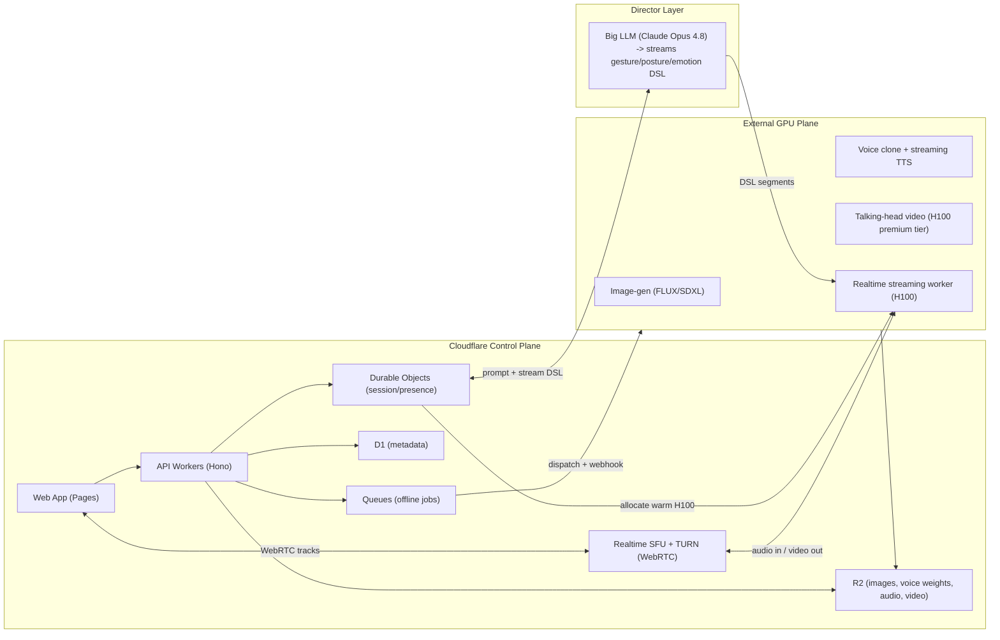
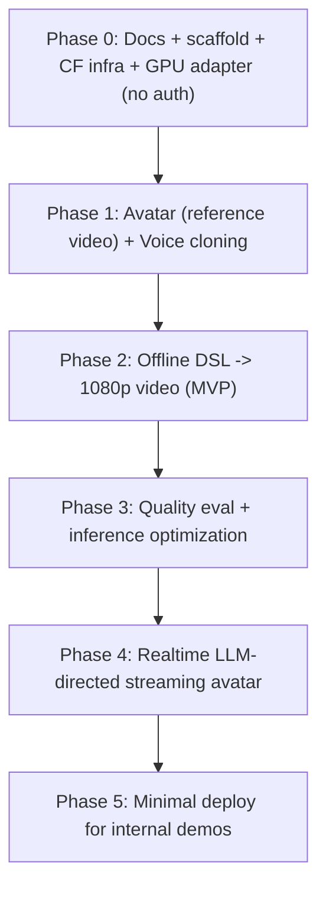

# LiveAvatarStream: Spec, Architecture, and Build Plan

This is the **complete end-to-end build plan** for LiveAvatarStream under [projects/LiveAvatarStream/](projects/LiveAvatarStream/): from founding docs and scaffold (Phase 0) through asset creation, offline generation, quality/perf, realtime streaming, and production/open-source hardening (Phase 5). It starts by producing the three artifacts the brief asks for (product spec, architecture, roadmap) and then builds the system phase by phase. Confirmed decisions:

- **Hybrid compute** — Cloudflare control plane + external GPU for inference.
- **Unified spec** covering both offline + real-time, with **offline as the MVP**.
- **H100-class GPUs are in budget for realtime**, so the realtime tier targets **HeyGen-like quality** (premium DiT talking-head models), not just consumer-GPU models.
- **The script is LLM-generated in realtime.** A big "director" model (e.g. Claude Opus 4.8) streams a structured gesture/posture/emotion DSL that drives how the avatar acts — the platform consumes that DSL, it is not just hand-authored.
- **Avatars are built from a short reference video (primary), not a single image.** This is the key realism lever: a 30s-2min portrait/half-body video (plus optional per-avatar fine-tune/LoRA) gives identity, dynamic expression range, and natural idle motion that a still image cannot. Single-image stays as a fast/casual fallback tier.
- **Internal tool, not a public system.** No auth/login, multi-tenant isolation, consent/watermarking/moderation, billing/quotas, or polished dashboards for now — access is via VPN/port-forward for demos. These are explicitly deferred so we focus on the generation + realtime engine and on speed/quality. Everything that can be avoided for an internal build is trimmed.

## Optimized for realism + performance?

Yes — the plan now explicitly engineers for it via four dedicated workstreams below: (1) **video-reference avatars + per-avatar fine-tune**, (2) an **output finishing stage** (face restoration + super-res + frame interpolation to true 1080p), (3) a **two-budget latency model** with a hardware media path (NVENC + WHIP/WHEP), and (4) **inference optimization + a quantitative quality eval harness**. These turn "highest quality and realistic" from an aspiration into measured exit criteria.

## Why hybrid (the central constraint)

Cloudflare Workers cannot run talking-head diffusion or voice-cloning models (no raw GPU). Cloudflare is excellent for everything *around* inference. So the system splits cleanly:



## Recommended model stack (documented with licensing flags)

- **Offline avatar video:** `OmniAvatar` / `EchoMimic-V3` for quality; `LivePortrait` (emotion-aware) + `Wav2Lip` refine as a lighter/faster tier.
- **Real-time avatar (HeyGen-like, H100 budget):** premium DiT path is `SoulX-FlashTalk` 14B (32 FPS, 0.87s startup — full realtime wants 8xH800; single H100 80GB runs it at reduced FPS) targeting top fidelity; `GAIR-NLP/LiveTalk` / `SoulX-FlashHead` (~25 FPS, 0.33s first-frame on a single H100/4090-class GPU) as the cost-efficient realtime default. Document a single-H100 default tier and a multi-H100/H800 premium tier with measured FPS so we can pick per quality target.
- **Voice (offline, quality):** `Fish Audio S2 Pro` (Apache, ~100ms TTFA, 80+ langs) primary; `F5-TTS` optional but **CC-BY-NC, non-commercial** — flagged, off by default for an open-source/commercial tool.
- **Voice (streaming):** `CosyVoice 2.0` / `XTTS-v2` / `Chatterbox-Turbo` for low-latency cloned-voice TTS.
- **Avatar source:** primary path is **reference video** (upload or webcam record) feeding a video-driven talking-head + optional per-avatar fine-tune/LoRA; `FLUX.1`/`SDXL` generated stills and direct image upload remain as the fast/casual tier.
- **Output finishing (quality):** face restoration + super-resolution (`GFPGAN` / `CodeFormer` + face-aware upscaler) and frame interpolation (`RIFE`) to deliver true **1080p at 30-50 fps** with temporal smoothness, since most talking-head models emit 256-512px.
- **STT for realtime:** streaming Whisper (`faster-whisper` / WhisperLive) with VAD-based endpointing.

All model choices captured in `ARCHITECTURE.md` with a license column so the open-source positioning stays clean.

## Quality & realism strategy

- **Per-avatar pipeline:** reference video -> face/identity extraction + optional lightweight fine-tune (LoRA/adapter) -> stored avatar profile in R2. Captures idle motion, expression range, and identity far better than a still.
- **Finishing chain on every output:** model frames -> face restoration -> super-res to 1080p -> RIFE interpolation -> NVENC encode. Realtime uses a lighter, latency-bounded version of the same chain.
- **Temporal stability:** prefer models with anti-drift/self-correction (SoulX self-correction) for long streams; cap identity drift via periodic reference re-anchoring.

## Performance & latency strategy

Split into **two distinct budgets** (the earlier single "<300ms" was conflating them):

- **Steady-state motion-to-photon (media):** target **<150ms** — GPU frame render -> NVENC -> WHIP ingest to Cloudflare SFU -> WHEP to browser. This is what makes lip-sync feel "live."
- **Turn response latency (conversational):** STT endpointing + director-LLM time-to-first-token + TTS time-to-first-audio + first video frame; realistically **~0.8-1.5s** to first spoken word. Documented with a per-stage table; mitigated by streaming DSL segment-by-segment so motion/speech start before the full turn is generated.
- **Inference optimization (first-class workstream):** TensorRT / FP8 (or INT8) quantization, `torch.compile`, CUDA graphs, continuous batching, KV-cache reuse (SGLang for TTS), pinned/warm models, and NVENC hardware encode on the H100 so no CPU encode bottleneck.
- **Warm H100 pool** managed by a Durable Object to eliminate cold starts for realtime sessions; serverless autoscale-to-zero only for offline jobs.

## Quality evaluation harness

Quality is measured, not asserted. `scripts/eval` computes: lip-sync (`Sync-C`/`Sync-D`, `LSE-C`), identity similarity (ArcFace cosine vs reference), visual quality (`FID`/`FVD`), and periodic human MOS. These become the exit criteria for the Phase 3 quality pass and gate any model swap.

## Script DSL (gesture / posture / emotion) — the LLM-director contract

The DSL is the **interface between the director LLM and the avatar pipeline**, not just an editor format. Define a JSON schema (`packages/protocol`) where a script is a stream of segments, each with `text`, `emotion`, `gesture`, `posture`, `emphasis`, `pause` (plus `seq`/`turnId` for ordering). Two producers:

- **Offline:** authored in the web editor (or LLM-assisted), submitted as a complete script.
- **Realtime:** a big "director" model (Claude Opus 4.8 by default, provider-agnostic) **streams DSL segments token-by-token** in response to user turns. A Durable Object owns the conversation, calls the LLM with a system prompt that constrains output to the DSL schema, and forwards each completed segment to the GPU streaming worker so speech + motion begin before the full turn is generated.

The GPU layer maps DSL fields to model conditioning: emotion -> expression params (LivePortrait) / emotion vectors; gesture/posture -> motion text-prompts (LiveTalk/SoulX-style); emphasis/pause -> TTS prosody controls. The schema is designed to be **easy for an LLM to emit reliably** (flat, enumerated gesture/emotion vocabularies, streaming-friendly). Documented in both spec and architecture, including the director system-prompt contract and the enumerated gesture/emotion/posture vocabularies.

## Documents to create

- [projects/LiveAvatarStream/PRODUCT_SPEC.md](projects/LiveAvatarStream/PRODUCT_SPEC.md) — vision, personas, user journeys (record/upload reference video to build avatar, clone voice, script+generate, real-time chat), feature scope (MVP vs later), the script DSL from a user's view, non-goals, success metrics (1080p quality + lip-sync + latency targets), open-source/licensing posture.
- [projects/LiveAvatarStream/ARCHITECTURE.md](projects/LiveAvatarStream/ARCHITECTURE.md) — workspace layout, the hybrid system diagram, control-plane vs GPU-plane responsibilities, reference-video avatar + per-avatar fine-tune pipeline, the finishing chain (restore/super-res/RIFE/NVENC to 1080p), offline data-flow sequence, real-time data-flow sequence (mic -> STT -> **director LLM streaming DSL** -> streaming TTS -> talking-head -> finishing -> NVENC -> WHIP/SFU/WHEP -> browser) with the **two-budget latency model** (<150ms steady-state media; ~0.8-1.5s turn response) and a per-stage latency table, the LLM-director contract + system-prompt design, inference optimization (TensorRT/FP8, torch.compile, CUDA graphs, batching), H100 realtime GPU tiers with measured FPS, the quality eval harness, R2 bucket layout, D1 schema (`erDiagram`), the model stack table with licenses, GPU provider options (Modal / fal.ai / Runpod serverless for offline, persistent warm H100 pool for realtime), DSL-to-conditioning mapping, key tradeoffs and risks (latency budgets, warm-pool cost of idle H100s, LLM streaming jitter, identity drift, license traps).
- [projects/LiveAvatarStream/ROADMAP.md](projects/LiveAvatarStream/ROADMAP.md) — phased build plan (below) as a `gantt` plus per-phase exit criteria.

Per the repo's `mermaid-diagrams` rule, all diagrams use Mermaid (no ASCII art).

## Monorepo scaffold (skeleton only, no business logic yet)

Mirrors the sibling `nord-meshnet-remote-desktop` convention:

```text
projects/LiveAvatarStream/
├── apps/web/              # Vite + React webapp (Pages)
├── services/control-api/  # Workers + Hono, D1/R2/Queues/DO bindings (wrangler.toml)
├── services/gpu/          # Containerized inference services (FastAPI)
│   ├── avatar-build/      # reference-video -> avatar profile (+ optional fine-tune)
│   ├── image-gen/         # FLUX/SDXL fast/casual avatars
│   ├── voice/             # clone + streaming TTS
│   ├── avatar-video/      # talking-head (offline + realtime tiers)
│   └── finishing/         # face restore + super-res + RIFE + NVENC
├── packages/protocol/     # Script DSL + job/event schemas + director LLM contract (shared TS)
└── scripts/
    └── eval/              # Sync-C/D, LSE-C, ArcFace identity, FID/FVD harness
```

Scaffold includes `package.json`s, a `wrangler.toml` with stub bindings, Dockerfile stubs for GPU services, and the protocol type definitions — enough to `npm install` and typecheck, no implemented endpoints.

## Build sequence (end to end)



### Phase 0 — Foundations

- **Docs:** write `PRODUCT_SPEC.md`, `ARCHITECTURE.md`, `ROADMAP.md` (the three artifacts above).
- **Scaffold + tooling:** npm workspaces, root `tsconfig`, ESLint/Prettier, task runner; `apps/web` Vite skeleton; service folders with Dockerfile stubs.
- **`packages/protocol`:** Zod schemas for the DSL (enumerated `emotion`/`gesture`/`posture` vocabularies + `text`/`emphasis`/`pause`/`seq`/`turnId`), `Job`, `JobEvent`, `AvatarProfile`, `VoiceProfile`, and the director-LLM request/stream contract. Single source of truth imported by web, api, and (via codegen/JSON schema) the Python GPU services.
- **Cloudflare infra:** `services/control-api` `wrangler.toml` with D1, R2 (`assets`, `avatars`, `voices`, `outputs`), KV, Queues, and Durable Object bindings; D1 migrations for the `erDiagram` schema; DO classes `SessionDO` (realtime) and `JobDO` (offline status). No auth layer — access gated by VPN/port-forward for demos; R2 upload (multipart) + download helpers only.
- **GPU provider adapter:** `GpuProvider` interface (`submitJob`, `pollJob`, `startSession`, `stopSession`) with a Modal implementation; a Queue consumer that round-trips a health-check job end to end.
- **Exit:** `npm install && npm run typecheck` green; a health-check job dispatched from a Worker runs on the GPU provider and writes a result to R2.

### Phase 1 — Avatar + Voice assets

- **`services/gpu/avatar-build`:** ingest reference video -> scene/face detection, crop, quality + liveness checks -> identity embedding (ArcFace) -> build `AvatarProfile` (keyframes, idle-motion clip, embedding); optional per-avatar LoRA/adapter fine-tune (toggle, async). Persist profile to R2 `avatars/<userId>/<avatarId>/`.
- **`services/gpu/image-gen`:** FLUX.1/SDXL text-to-avatar for the fast/casual fallback tier (no reference video).
- **`services/gpu/voice`:** clone from a 10-30s sample -> speaker embedding/weights to R2 `voices/...`; expose a TTS smoke endpoint to validate the cloned voice.
- **`apps/web`:** avatar creation flow (webcam record or upload reference video, with on-device guidance), voice capture/upload flow, asset library; `control-api` upload + asset-record endpoints.
- **Exit:** a user creates an avatar from a reference video and a cloned voice; both persist and are listable; fallback image-gen avatar also works.

### Phase 2 — Offline generation (MVP deliverable)

- **`apps/web`:** DSL script editor — ordered segments with `text` + emotion/gesture/posture/emphasis/pause controls, plus an "LLM-assist" button that drafts a DSL script from a plain prompt (director LLM in non-streaming mode).
- **`control-api`:** `POST /jobs` enqueues a generation job (avatar + voice + DSL) to Queues; `JobDO` tracks status; `GET /jobs/:id` + result download.
- **Queue consumer (orchestrator):** calls `voice` (TTS with DSL prosody) -> `avatar-video` (OmniAvatar/EchoMimic conditioned on audio + DSL motion prompts) -> `finishing` (GFPGAN/CodeFormer restore + super-res to 1080p + RIFE + ffmpeg mux of audio) -> upload mp4 to R2 `outputs/...`.
- **Exit:** end-to-end offline generation produces a downloadable **1080p mp4** with the cloned voice and DSL-driven gestures/expressions; status visible live in the web app.

### Phase 3 — Quality + performance pass

- **`scripts/eval`:** implement Sync-C/Sync-D + LSE-C (lip-sync), ArcFace identity cosine vs reference, FID/FVD (visual quality), and a small MOS rubric; produce a report per model/config.
- **Inference optimization:** TensorRT engines / FP8 (or INT8) quantization, `torch.compile`, CUDA graphs, continuous batching, SGLang KV-cache reuse for TTS; cache model weights in R2 + local volume to cut cold starts.
- **Tiered models:** wire a fast tier (LivePortrait+Wav2Lip) and a premium tier (OmniAvatar/EchoMimic) selectable per job; pick defaults from eval results.
- **Exit:** premium tier passes quality thresholds (target Sync-C, identity > threshold, FID below budget) and offline gen-time per minute-of-video meets the speed target; results recorded in the eval report.

### Phase 4 — Realtime LLM-directed streaming

- **Media path:** Cloudflare Realtime SFU; GPU worker encodes via **NVENC** and ingests with **WHIP**; browser subscribes via **WHEP**. `apps/web` realtime session UI: mic capture, remote video render, VAD/push-to-talk, interrupt button.
- **`SessionDO`:** owns a session, allocates from a **warm H100 pool**, holds conversation state, calls the director LLM with the DSL-constrained system prompt, and forwards streamed DSL segments to the GPU worker; handles **barge-in** (cancel in-flight TTS/video on user interrupt).
- **`services/gpu` realtime worker:** streaming STT (WhisperLive) -> director LLM streaming DSL -> streaming TTS (CosyVoice2/XTTS) -> realtime talking-head (LiveTalk/SoulX, H100 tiered) -> light finishing -> NVENC -> WHIP.
- **Exit:** a live two-way conversation with the avatar; **<150ms steady-state motion-to-photon**, **~0.8-1.5s turn response**, working barge-in, stable identity over multi-minute sessions.

### Phase 5 — Minimal deploy (internal)

- **Deploy scripts:** `wrangler deploy` for the control plane + GPU image build/push + pool start scripts; `.env.example` with provider/LLM tokens.
- **Brief ops notes:** short `SETUP.md` / `OPERATIONS.md` (how to run, how to point the demo through VPN/port-forward, how to start/stop the warm pool to control cost) and basic run logs.
- **Exit:** a teammate can deploy and reach a working demo over VPN/port-forward.

Deferred (not now): auth/login, multi-tenant isolation, consent capture + watermarking + moderation, billing/quotas, dashboards/alerting, public open-source packaging + license matrix.

## Cross-cutting concerns (kept minimal)

- **Testing:** Vitest unit tests for `packages/protocol` + orchestrator logic, GPU service smoke endpoints, and a manual e2e checklist for the web flows and a realtime session. No heavy e2e suite yet.
- **Cost control:** warm H100 pool with idle timeout + start/stop scripts (idle GPU is the dominant realtime cost); autoscale-to-zero for offline jobs.
- **Provider-agnostic seams:** `GpuProvider` and `DirectorLLM` are interfaces so Modal/Runpod/CoreWeave and Opus 4.8/other frontier models are swappable.

## Notes / assumptions (chosen as defaults, adjust if needed)

- Web stack: Vite + React + TypeScript (lighter than Next for a Pages SPA).
- API framework: Hono on Workers; DSL validation via Zod shared from `packages/protocol`.
- GPU defaults: Modal for serverless offline jobs + Runpod/CoreWeave for persistent realtime H100 pods, behind the `GpuProvider` adapter.
- Director LLM default Claude Opus 4.8, behind the `DirectorLLM` interface.
- No auth for now — internal access via VPN/port-forward; auth/consent/hardening deferred to a later pass.
- GPU services are Python (FastAPI); everything else is TypeScript. The DSL/job contracts are generated from `packages/protocol` so Python and TS stay in sync.