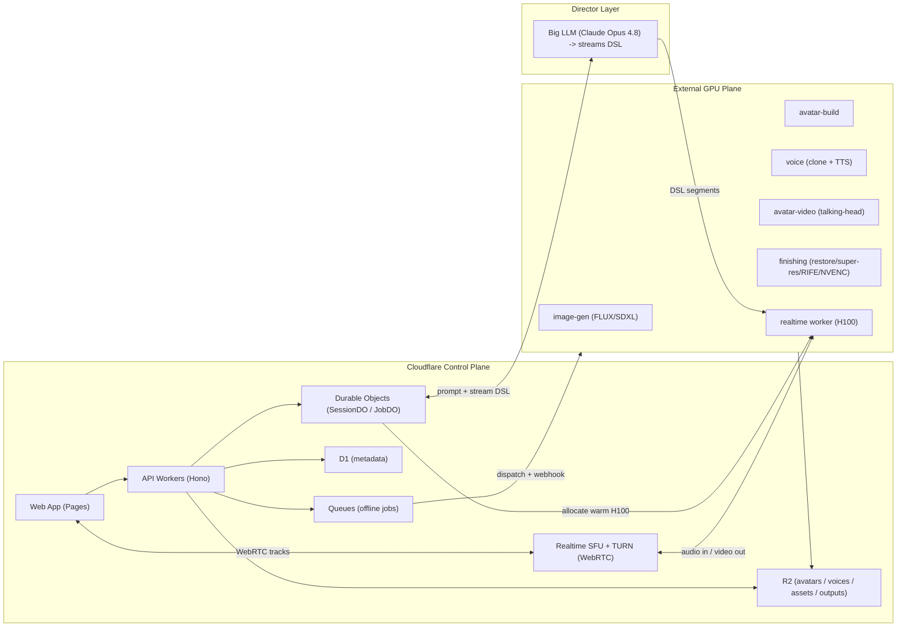
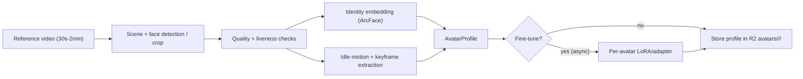
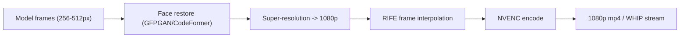
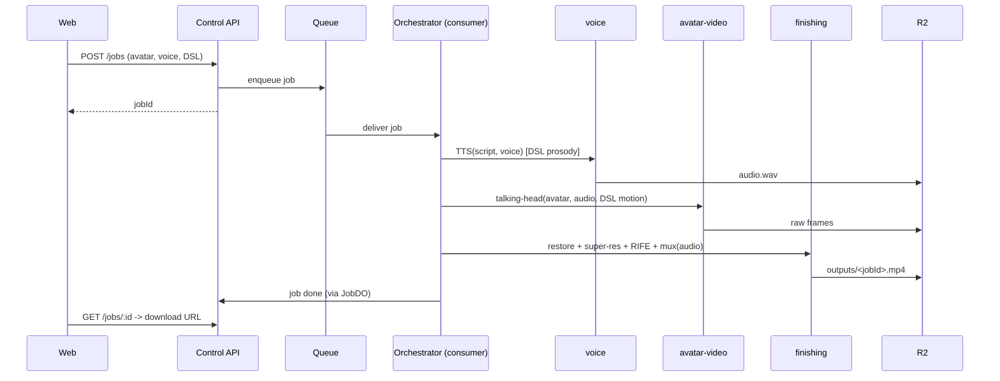
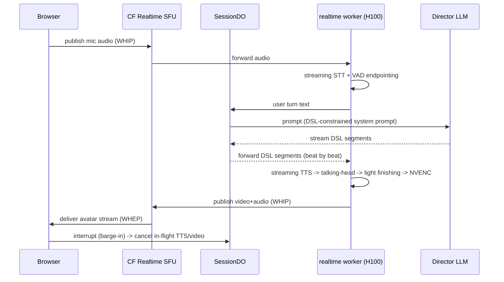
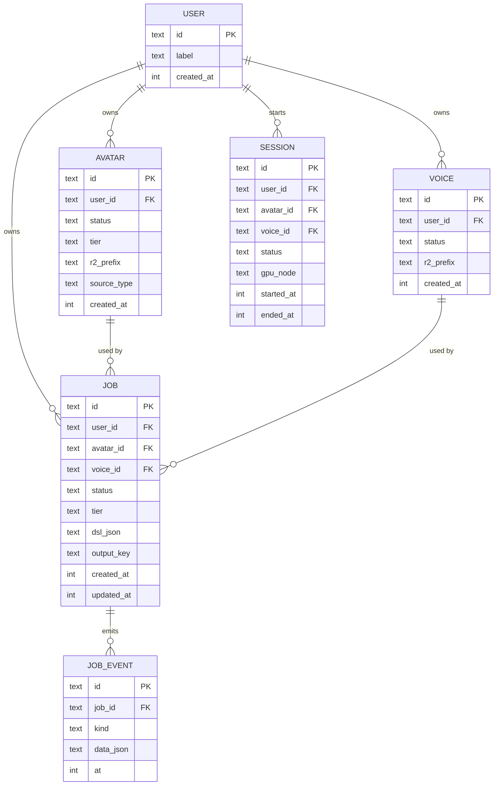

# LiveAvatarStream — Architecture

> **⚠️ Scope note (2026-06-26):** this document predates the consolidation. This repo
> (`LiveAvatarStream3D`) is now a **browser-only 3D talking-avatar studio** — the headless
> `engine-three` renderer was removed and the 2D (EchoMimicV3) + MuseTalk realtime paths were
> relocated to `../LiveAvatarStream`. Sections below about engine-three, the 2D pipeline,
> realtime/SFU, `scene-editor`, and `apps/web` are historical. For the current system see
> `CLAUDE.md` and `docs/specs/2026-06-25-performance-score-dsl-design.md`.

## Workspace layout

```text
projects/LiveAvatarStream/
├── apps/web/              # Vite + React webapp (deploys to Cloudflare Pages)
├── services/control-api/  # Cloudflare Workers + Hono; D1/R2/KV/Queues/DO bindings
├── services/gpu/          # Containerized Python inference services (FastAPI)
│   ├── avatar-build/      # reference video -> AvatarProfile (+ optional LoRA)
│   ├── image-gen/         # FLUX/SDXL fast/casual avatar stills
│   ├── voice/             # voice clone + (streaming) TTS
│   ├── avatar-video/      # talking-head: offline (premium) + realtime tiers
│   ├── finishing/         # face restore + super-res + RIFE + NVENC
│   └── realtime/          # realtime session worker (STT->LLM->TTS->video->WHIP)
├── packages/protocol/     # Shared TS: DSL schema (zod) + job/event/director contracts
└── scripts/
    ├── eval/              # Sync-C/D, LSE-C, ArcFace identity, FID/FVD harness
    └── deploy/            # control-plane + GPU deploy / pool start-stop scripts
```

The control plane is TypeScript; the GPU plane is Python. The DSL/job contracts are the single source of truth in `packages/protocol` and are exported to JSON Schema for the Python services so both sides stay in sync.

## Why hybrid (the central constraint)

Cloudflare Workers cannot run talking-head diffusion or voice-cloning models — there is no raw GPU. Cloudflare is excellent for everything *around* inference (web, API, storage, queues, coordination, WebRTC media routing). So the system splits cleanly into a **control plane** (Cloudflare) and a **GPU plane** (external H100s).



### Control-plane responsibilities
- Serve the web app and the REST API (Hono on Workers).
- Persist metadata in **D1**, blobs in **R2**, ephemeral/cache in **KV**.
- Enqueue offline jobs to **Queues**; a consumer Worker orchestrates the GPU pipeline.
- Coordinate realtime sessions and the warm GPU pool via **Durable Objects**.
- Route realtime media via **Cloudflare Realtime** (SFU + TURN).

### GPU-plane responsibilities
- All heavy inference: avatar build, image-gen, voice clone + TTS, talking-head, finishing, and the realtime loop.
- Read inputs from / write outputs to R2 via presigned URLs handed out by the control plane.

## Reference-video avatar pipeline



A video reference (vs a single still) is the key realism lever: it captures identity from multiple angles, expression range, and natural idle motion. Single image / FLUX-gen remains a fast fallback tier.

## Finishing chain (quality)

Most talking-head models emit 256–512px faces. Every output runs a finishing chain to reach true 1080p with temporal smoothness:



Realtime uses a lighter, latency-bounded version of the same chain.

## Offline data flow



## Realtime data flow



### Two-budget latency model

The earlier single "<300 ms" target conflated two very different things. They are tracked separately:

| Stage | Budget |
|---|---|
| **Steady-state motion-to-photon (media)** | GPU render → NVENC → WHIP → SFU → WHEP → browser | **< 150 ms** |
| Turn response — STT endpointing | ~150–400 ms (VAD silence) |
| Turn response — director LLM TTFT | ~200–600 ms |
| Turn response — TTS time-to-first-audio | ~100–200 ms |
| Turn response — first video frame | ~100–300 ms |
| **Turn response total (to first spoken word)** | **~0.8–1.5 s** |
| Barge-in cancel | < 300 ms |

Mitigation: the director LLM **streams DSL segment-by-segment**, so TTS and video start on the first beat instead of waiting for the whole turn.

## Inference optimization

- TensorRT engines / FP8 (or INT8) quantization for the talking-head + TTS models.
- `torch.compile` + CUDA graphs to cut per-step Python/launch overhead.
- Continuous batching; SGLang-style KV-cache reuse for the TTS/LLM token path.
- Pinned/warm models in a persistent process — no per-request model load.
- **NVENC** hardware encode on the H100 so there is no CPU encode bottleneck.
- Model weights cached in R2 + a local volume to cut cold starts.

## Realtime GPU tiers

| Tier | Models | Hardware | Throughput |
|---|---|---|---|
| Default (cost-efficient) | LiveTalk / SoulX-FlashHead | single H100 (or 4090/5090) | ~25 fps, ~0.33 s first frame |
| Premium (max fidelity) | SoulX-FlashTalk 14B | multi-H100 / 8×H800 for full rate; single H100 80GB at reduced fps | up to 32 fps |

Tier is selectable per session; the eval harness sets the production default.

## Quality evaluation harness

`scripts/eval` computes, per model/config:
- Lip-sync: `Sync-C` / `Sync-D`, `LSE-C`.
- Identity: ArcFace cosine similarity vs the reference.
- Visual quality: `FID` / `FVD`.
- Human `MOS` rubric (periodic).

These are the **exit criteria** for the Phase 3 quality pass and gate any model swap.

## R2 bucket layout

```text
avatars/<userId>/<avatarId>/profile.json        # AvatarProfile
avatars/<userId>/<avatarId>/keyframes/*.png
avatars/<userId>/<avatarId>/idle.mp4
avatars/<userId>/<avatarId>/lora.safetensors    # optional fine-tune
voices/<userId>/<voiceId>/embedding.bin          # speaker embedding / weights
voices/<userId>/<voiceId>/sample.wav
assets/<userId>/uploads/<assetId>                # raw uploads (reference video, etc.)
outputs/<jobId>.mp4                              # finished offline render
```

(`<userId>` is a stable per-operator id even though there is no auth yet — keeps the layout forward-compatible.)

## D1 schema



## Model stack (with licenses)

| Role | Default | Alternates | License note |
|---|---|---|---|
| Offline talking-head | OmniAvatar / EchoMimic-V3 | LivePortrait + Wav2Lip (fast tier) | check per-repo; LivePortrait permissive |
| Realtime talking-head | LiveTalk / SoulX-FlashHead | SoulX-FlashTalk 14B (premium) | open weights; verify before public release |
| Voice clone + TTS (offline) | Fish Audio S2 Pro | F5-TTS (**CC-BY-NC, off by default**) | F5-TTS non-commercial |
| Voice clone + TTS (streaming) | CosyVoice 2.0 | XTTS-v2, Chatterbox-Turbo | CosyVoice/Chatterbox permissive; XTTS CPML |
| Avatar still (fallback) | FLUX.1 | SDXL | FLUX dev non-commercial — flag; SDXL permissive |
| STT (realtime) | faster-whisper / WhisperLive | — | MIT |
| Director LLM | Claude Opus 4.8 | any frontier model | API, behind `DirectorLLM` interface |

## GPU provider options

| Use | Provider | Mode |
|---|---|---|
| Offline jobs | Modal (default) | serverless, autoscale-to-zero |
| Offline jobs | fal.ai / Runpod serverless | alternate |
| Realtime | Runpod / CoreWeave persistent pods | warm H100 pool, idle timeout |

Both sit behind the `GpuProvider` interface (`submitJob` / `pollJob` / `startSession` / `stopSession`).

## DSL → conditioning mapping

| DSL field | Maps to |
|---|---|
| `text` | TTS input |
| `emphasis[]` | TTS prosody emphasis |
| `pause_ms_after` | TTS / timeline gap |
| `emotion` | expression params (LivePortrait) / emotion vector |
| `gesture` | motion text-prompt (LiveTalk/SoulX) / gesture token |
| `posture` | body/pose conditioning prompt |

Vocabularies (enumerated in `packages/protocol`):
- `emotion`: `neutral, warm, happy, excited, serious, concerned, sad, confident, thoughtful, surprised`
- `gesture`: `none, wave, point, open_palms, count, thumbs_up, nod, shrug, hand_to_chest, explain`
- `posture`: `neutral, leaning_in, upright, relaxed, turned_slightly`

## Key tradeoffs & risks

- **Idle H100 cost** dominates realtime spend → warm pool with idle timeout + explicit start/stop scripts.
- **LLM streaming jitter** can starve the TTS/video pipeline → buffer one segment ahead, smooth with idle motion.
- **Identity drift** over long streams → periodic reference re-anchoring; prefer self-correcting models.
- **License traps** (F5-TTS, FLUX-dev) → flagged off-by-default; permissive defaults chosen.
- **Latency budget** is the hardest realtime constraint → measured per-stage, NVENC + WHIP/WHEP keep the media path tight.
