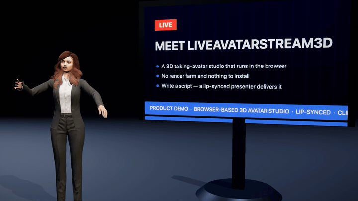
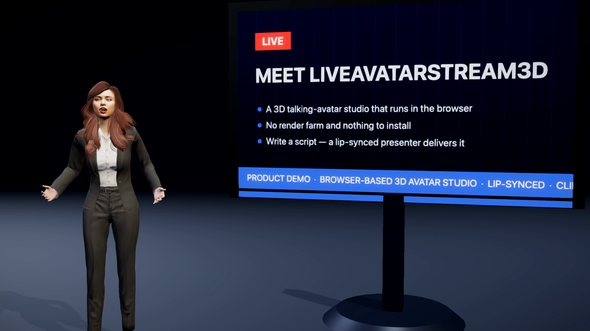
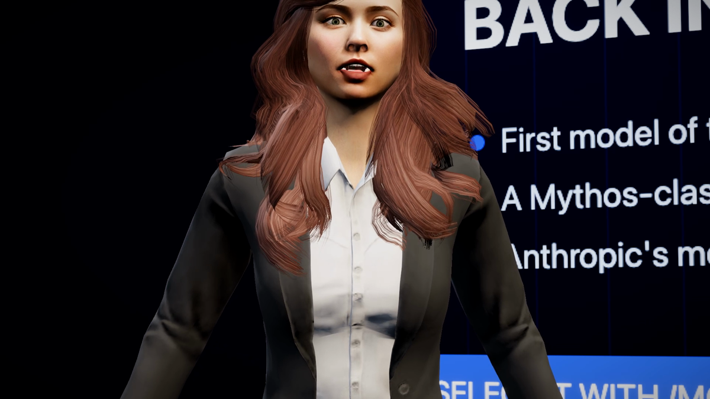
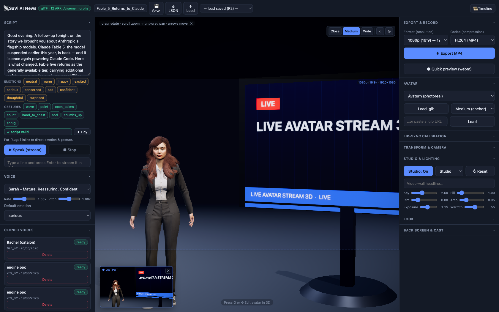
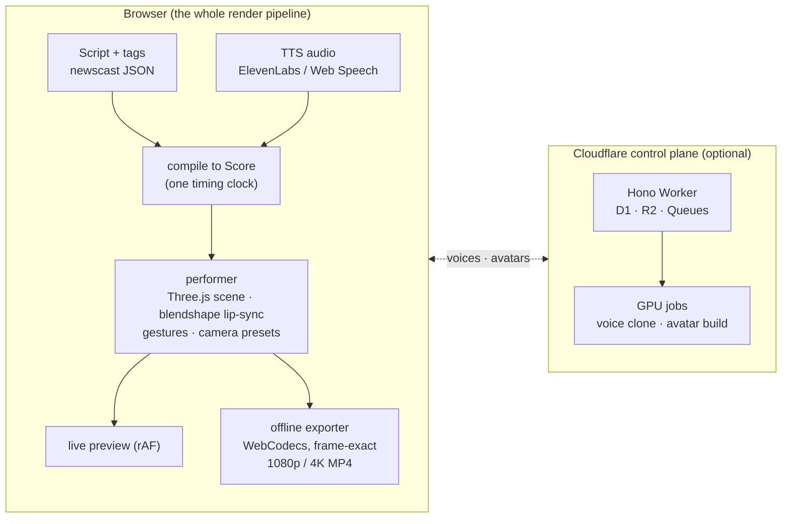

<div align="center">

# 🎬 LiveAvatarStream3D

**Write a script. A 3D presenter delivers it — lip-synced, camera-directed, and exported to MP4. Entirely in your browser.**

[](https://github.com/tech-sumit/LiveAvatarStream3D/actions/workflows/ci.yml)
[](LICENSE)
[](package.json)
[](tsconfig.base.json)
[](apps/avatar-live)
[](CONTRIBUTING.md)

### [▶ **Try it live** — las3d-studio.pages.dev](https://las3d-studio.pages.dev/)

*No install, no keys: the hosted studio runs the full live preview with free browser voices (Chrome/Edge recommended). Paste your own ElevenLabs key in the Voice panel (it stays in your browser) to unlock real voices and MP4 export right in the demo.*



*Every pixel above was rendered by a browser tab — no render farm, no GPU server, no upload.*

</div>

---

## Why this exists

Tools like HeyGen and Synthesia turn scripts into presenter videos — on their servers, with their avatars, at their price. **LiveAvatarStream3D does it as an open-source studio that runs client-side:**

- 🖥️ **No render server.** The 3D scene renders live with Three.js and exports frame-exact MP4 (1080p or 4K) with WebCodecs, right in the tab.
- ✍️ **Direction is data, not editing.** Emotion, gestures, and camera work are inline script tags and JSON — versionable, diffable, generatable by an LLM.
- 🤖 **Agent-native.** The studio exposes its controls as an in-page [WebMCP](https://github.com/webmachinelearning/webmcp) server, so AI agents (Claude Code, or anything MCP-speaking) can author, direct, and export videos autonomously.

## See it

A moment from a newscast produced end-to-end by an AI agent driving this studio — script, camera direction, wall slides, ticker, music bed, and export:


Full 1080p MP4s (with audio) are on the [**Releases page**](https://github.com/tech-sumit/LiveAvatarStream3D/releases) →

> **Note:** all sample newscasts in this repo are **fictional demo content**, written to exercise the pipeline. They are not real news, and this project is not affiliated with or endorsed by any company mentioned in them.

| | |
|---|---|
|  |  |
| The anchor pitches beside the video wall (`two-shot`) | Cinematic low-angle framing (`hero-low`), one tag away |

## The studio



One screen: script editor with emotion/gesture tag palette, voice picker (cloned voices included), live 3D viewport with the exact export framing overlaid, studio lighting rig, and one-click MP4 export.

## Quickstart

**Zero-install:** open the [hosted demo](https://las3d-studio.pages.dev/) — script, direct, and preview entirely in your browser. Local setup unlocks MP4 export with your own ElevenLabs voices:

```bash
git clone https://github.com/tech-sumit/LiveAvatarStream3D.git
cd LiveAvatarStream3D
npm install
bash apps/avatar-live/scripts/fetch-avatars.sh      # avatar models (not redistributed in-repo)
bash apps/avatar-live/scripts/fetch-animations.sh   # gesture/locomotion clips
npm run dev:avatar     # → http://localhost:5175
```

**Out of the box (no keys):** type a script and get the live lip-synced 3D preview with free browser Web Speech voices.
**For MP4 export:** add an ElevenLabs key to `apps/avatar-live/.env` (copy [`.env.example`](apps/avatar-live/.env.example)) — the exporter renders from a synthesized narration buffer, and browser Web Speech audio can't be captured.

**Browser support:** Chrome/Edge — full studio + MP4 export. Firefox/Safari — live preview (WebCodecs MP4 support varies; the app falls back to a WebM quick preview). Agent control via WebMCP — Chrome 146+.

> The optional Cloudflare control plane (voice cloning, avatar builds) lives in [`services/`](services/) — the studio runs fully without it. Cloud project storage is a studio-side R2 proxy configured by the `R2_*` keys in the same `.env`; without them, projects persist to localStorage.

## Direct it like a script

Performance direction lives *inside* the text — emotion and gesture tags, exactly as the parser reads them:

```
[serious] Good evening. A follow-up tonight on the story we brought you earlier.
[confident][point] The numbers on the wall tell the story.
[happy][open_palms] And that changes everything.
```

For full productions there's a **newscast document** — sections, beats, camera presets, wall slides, tickers, and a music bed — compiled onto one timing clock with the narration audio. Abridged from a real, valid document ([full schema](packages/protocol/src/newsreport.ts)):

```jsonc
{
  "version": 2,
  "meta": { "title": "Fable 5 Returns", "anchors": [{ "id": "ava", "name": "Ava Lin", "avatarUrl": "avaturn-model", "voiceId": "..." }] },
  "rundown": [{
    "headline": "What Changed",
    "bullets": ["Back in Claude Code", "A new model tier"],
    "beats": [{
      "text": "Here is what changed. Fable five returns as the generally available tier.",
      "gesture": "point",
      "camera": { "preset": "hero-low" },
      "pause_ms_after": 300
    }]
  }]
}
```

Ten camera framings ship as data (a [catalog table](packages/performer-core/src/cameraShots.ts), not code): `close` · `medium` · `wide` · `two-shot` · `ots-screen` · `profile` · `hero-low` · `dutch` · `establish` · `push-in`.

## Agents can run the whole studio

The studio registers its controls on the page's model context (the emerging [WebMCP](https://github.com/webmachinelearning/webmcp) standard) — including on the [hosted demo](https://las3d-studio.pages.dev/). Open it in a WebMCP-capable Chrome (146+) and any in-browser LLM or MCP bridge — e.g. [`@tech-sumit/mcp-webmcp`](https://www.npmjs.com/package/@tech-sumit/mcp-webmcp) — can set the newscast, restyle the wall, and export the MP4, hands-free. The demo videos in this README were produced exactly that way, by Claude Code.

**→ [How to connect an agent + the 23-tool catalog](docs/webmcp.md)**

## How it works



The key design decision: **the live preview and the export run the same performance code on the same clock.** What you see is exactly what renders — lip-sync mouth tracks, gesture timing, camera moves, music and SFX are all deterministic per frame.

| Workspace | What it is |
|---|---|
| [`apps/avatar-live`](apps/avatar-live) | The studio. Vanilla TS + Three.js; glTF ARKit/viseme blendshape avatars, Mixamo-retargeted gestures/locomotion, WebCodecs export, WebMCP server. |
| [`packages/performer-core`](packages/performer-core) | Framework-agnostic runtime: the camera shot catalog, pure-math shot composition, motion/gesture solvers. |
| [`packages/protocol`](packages/protocol) | Shared contracts: the script DSL, the Score model + compiler, the newscast document + compiler, studio bridge tools (zod → JSON Schema). |
| [`services/control-api`](services/control-api) | Cloudflare Worker (Hono): voices, avatars, uploads, job orchestration; D1 + R2 + Queues + Durable Objects. |
| [`services/gpu`](services/gpu) | Python GPU jobs the control plane dispatches: voice cloning and avatar builds (plus a standalone image-gen service, not yet wired to the orchestrator). |
| [`services/newsroom-mcp`](services/newsroom-mcp) | stdio MCP for asset generation: card graphics, montages, music, post-production. |

## Status & limitations

An honest map of where this is today:

- **Chromium-first.** MP4 export needs WebCodecs H.264 (Chrome/Edge); other browsers get the live preview and a WebM fallback.
- **MP4 narration requires an ElevenLabs key.** Web Speech covers the free live preview only — its audio cannot be captured into an export.
- **Single-user POC.** No auth on the studio; the control plane user is hardcoded. The Worker supports token auth via config.
- **Export speed:** a 56 s 1080p newscast takes ~8–10 minutes on an M-series MacBook (frame-exact offline render, works in a backgrounded tab).
- **Tested where it counts:** 380+ unit tests across the workspaces; typecheck + tests in CI on every PR; the demo newscasts here exercised the full pipeline end-to-end.

## Roadmap

The active direction is making **all** direction data-driven — one interpreter, zero hardcoded performance code:

- **Score/Stage DSL** — a parameterized, spatial, compositional performance model ([design spec](docs/specs/2026-06-25-performance-score-dsl-design.md))
- **WebMCP-first control** — the studio as a first-class agent tool surface ([design spec](docs/specs/2026-06-25-webmcp-studio-control-design.md))
- More avatars, more stages, more chrome packs

Specs live in [`docs/specs/`](docs/specs/) — the repo is built spec-first. The founding brief is preserved in [`docs/original-product-brief.md`](docs/original-product-brief.md).

## Third-party assets

Avatar models and animation clips are **not redistributed in this repo** — the fetch scripts pull them from their sources under their own terms (Avaturn avatars; Mixamo/Ready-Player-Me animation clips). Bundled media credits are listed in [THIRD-PARTY-NOTICES.md](THIRD-PARTY-NOTICES.md). The MIT license covers the **code**; fetched assets remain under their providers' licenses.

## Contributing

Issues and PRs welcome — see [CONTRIBUTING.md](CONTRIBUTING.md). Good first areas: camera presets (it's a data table), gesture clips, stage/chrome styling, docs.

## License

[MIT](LICENSE) © 2026 [Sumit Agrawal](https://sumitagrawal.dev) — code only; third-party assets keep their own licenses.

---

<div align="center">

Built by **[Sumit Agrawal](https://sumitagrawal.dev)** ([@tech-sumit](https://github.com/tech-sumit)) — I build agent-native tools, realtime avatar systems, and the occasional robot brain.

If this saved you a render farm, you know where the star button is.

</div>
