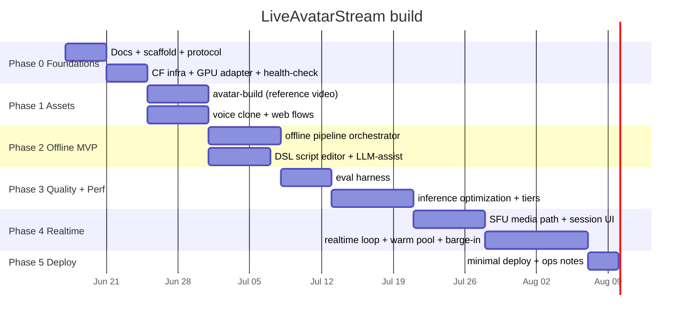

# LiveAvatarStream — Roadmap

End-to-end build sequence. Each phase has an explicit exit criterion. This is an internal tool, so auth/consent/hardening are deferred (see bottom).

## Phase 0 — Foundations
Docs (`PRODUCT_SPEC`, `ARCHITECTURE`, `ROADMAP`); monorepo scaffold + tooling; `packages/protocol` (Zod DSL + job/event/director contracts); Cloudflare infra (D1 migrations, R2 buckets, KV, Queues, `SessionDO`/`JobDO`); `GpuProvider` adapter (Modal) + Queue consumer health-check. No auth.

**Exit:** `npm install && npm run typecheck` green; a health-check job dispatched from a Worker runs on the GPU provider and writes a result to R2.

## Phase 1 — Avatar + Voice assets
`avatar-build` (reference video → crop/QC → ArcFace identity → `AvatarProfile`; optional LoRA); `image-gen` fallback; `voice` clone + TTS smoke; web capture/upload flows + asset library + upload endpoints.

**Exit:** a user creates an avatar from a reference video and a cloned voice; both persist and list; fallback image-gen avatar works.

## Phase 2 — Offline generation (MVP)
DSL script editor + LLM-assist draft; `POST /jobs` → Queue; orchestrator runs TTS → talking-head → finishing → 1080p mp4 in R2; live status via `JobDO`; preview + download.

**Exit:** end-to-end offline generation yields a downloadable 1080p mp4 with cloned voice + DSL-driven gestures; status visible live.

## Phase 3 — Quality + performance
`scripts/eval` (Sync-C/D, LSE-C, ArcFace, FID/FVD, MOS); inference optimization (TensorRT/FP8, torch.compile, CUDA graphs, batching, weight caching); tiered fast/premium models.

**Exit:** premium tier passes quality thresholds and meets the offline gen-time target; results recorded in the eval report.

## Phase 4 — Realtime LLM-directed streaming
SFU media path (NVENC + WHIP/WHEP) + realtime session UI; `SessionDO` warm-pool + director-LLM loop; realtime worker (STT → LLM DSL → TTS → talking-head → light finishing); barge-in.

**Exit:** live two-way conversation; <150 ms steady-state media, ~0.8–1.5 s turn response, working barge-in, stable identity over multi-minute sessions.

## Phase 5 — Minimal deploy (internal)
Deploy scripts (`wrangler deploy` + GPU image build/push + pool start/stop); brief `SETUP.md` / `OPERATIONS.md`; VPN/port-forward demo access.

**Exit:** a teammate can deploy and reach a working demo over VPN/port-forward.

## Deferred (not in current scope)
Auth/login, multi-tenant isolation, consent capture + watermarking + moderation, billing/quotas, dashboards/alerting, public open-source packaging + license matrix.
