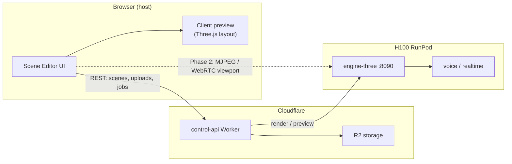

# Scene Editor — Architecture

> **Superseded (Jun 20, 2026)** by [`specs/2026-06-20-scene-editor-threejs.md`](specs/2026-06-20-scene-editor-threejs.md).
> This file describes the original React editor design. Current work uses the
> official three.js editor; React code lives on `backup/custom-scene-editor`.

Web-based 3D scene editor (Unity / Blender / Unreal-like) for LiveAvatarStream3D.
**Authoring runs in the browser; final pixels come from the H100 render node.**

## Goals

| Capability | Description |
|---|---|
| Camera | Set position, rotation, FOV; see exact framing in viewport |
| Scene graph | Add / remove / transform avatars, props, lights |
| Assets | Upload GLB props; register avatars |
| Dialog | Script segments, lip-sync via existing TTS + morph pipeline |
| Record | Compile `PerformanceManifest` → `engine_render` job on H100 |
| Live | Realtime speech via MuseTalk + Cloudflare SFU (existing path) |

## System split



### Principle: dual viewport

1. **Client preview (MVP, now)** — lightweight Three.js in the browser for layout,
   gizmos, and camera framing. Uses the same Y-up convention as `engine-three`.
2. **Server-authoritative render (always for export)** — H100 runs headless
   `engine-three` with `gl` + Xvfb. Client preview is approximate (no meshopt/canvas
   parity); a **Preview on GPU** button hits `POST /preview` on the pod for a
   single authoritative PNG (Phase 1).

## Viewport streaming (recommendation)

| Option | Pros | Cons | Verdict |
|---|---|---|---|
| **Client Three.js only** | Zero latency, no pod load | Not pixel-identical to H100 | **MVP** |
| **POST /preview → PNG** | Authoritative frame, simple | Not real-time (~1–3 s) | **Phase 1** |
| **MJPEG over HTTP** | Simple proxy through nginx | Bandwidth, no input sync | **Phase 2 live layout** |
| **WebRTC (Cloudflare SFU)** | Low latency, bidirectional | Heavy; already used for MuseTalk | **Phase 3 live speech** |

**Recommended path:** client preview for editing → on-demand `/preview` for
WYSIWYG check → full `engine_render` for mp4 → existing realtime session for live
speech.

## Data model

### `SceneDocument` (`@las/protocol/scene.ts`)

Authoring graph stored in R2 as `scenes/{userId}/{sceneId}.json`:

- `nodes[]`: `avatar | prop | light | camera`
- `activeCameraId`: render viewport
- `stage`: level, lighting preset, background color

Compiled at job time:

```
SceneDocument + Script + voiceId
  → compileManifest() → PerformanceManifest
  → engine-three /render
```

Camera nodes in the editor map to explicit `CameraShotKeyframe` entries when the
user adds timeline keyframes (Phase 1). MVP uses the active camera transform +
`shotBasePosition()` defaults for the single static shot.

### Asset pipeline

```
Upload GLB → POST /api/uploads → R2
           → POST /api/scene-assets (new) → registry entry
Editor places prop node → assetKey in SceneDocument
engine-three loadProp() (Phase 1) reads from pod cache or R2 pull
```

Avatar GLBs live under `services/engine-three/assets/avatars/` on the pod (seeded
from R2 on deploy).

## API surface (phased)

### Exists today

- `POST /api/uploads` — asset upload
- `POST /api/engine-jobs` — cinematic render
- `POST /api/sessions` — live realtime
- `POST /api/voices` — voice clone
- `POST /api/director/draft` — LLM script assist

### New (control-api)

| Route | Purpose | Phase |
|---|---|---|
| `GET/POST/PUT /api/scenes` | CRUD SceneDocument in R2 | MVP |
| `POST /api/scene-assets` | Register uploaded GLB | 1 |
| `POST /api/engine-jobs/:id/preview-frame` | Proxy to pod `/preview` | 1 |
| `GET /api/scenes/:id/stream.mjpeg` | MJPEG viewport proxy | 2 |

### New (engine-three on pod)

| Route | Purpose | Phase |
|---|---|---|
| `POST /preview` | SceneDocument → single PNG (base64 or R2 key) | 1 |
| `WS /stream` | Scene sync + frame push for MJPEG encoder | 2 |
| `POST /render-live` | MuseTalk lip-sync frame loop | 3 |

Auth: reuse `x-internal-token` pod-side; browser uses Worker session + userId
namespace (same as existing web app).

## Editor app (`apps/scene-editor`)

Vite + React + Three.js. Run: `npm run dev:editor` (port **5174**).

| Panel | Role |
|---|---|
| Viewport | OrbitControls + scene graph render |
| Scene graph | Hierarchy, add/remove nodes |
| Inspector | Transform, camera FOV, light params |
| Script | Dialog segments → engine_render |
| Toolbar | Save, Preview GPU, Record, Go Live |

## Implementation phases

### Phase 0 — MVP scaffold ✅ (this PR)

- [x] `SceneDocument` schema + default scene factory
- [x] `apps/scene-editor` with client viewport + inspector + script panel
- [x] Wire Record → `POST /api/engine-jobs`
- [ ] Persist scenes to R2 (localStorage fallback in MVP)

### Phase 1 — WYSIWYG + assets

- R2 scene CRUD in control-api
- `engine-three POST /preview` (headless single frame from SceneDocument)
- Prop loading from uploaded GLB
- Camera keyframe timeline → `PerformanceManifest.camera[]`

### Phase 2 — Live layout stream

- MJPEG or WebSocket frame stream from pod through nginx `/engine-three/stream`
- Editor shows H100 pixels while editing transforms (debounced scene sync)

### Phase 3 — Live speech

- Bridge editor → existing MuseTalk realtime session
- Mic input → XTTS/stream → lip-sync on H100 → WebRTC to browser
- Record live session to mp4 (existing finishing path)

## nginx / RunPod exposure

Existing gateway pattern:

```
https://{pod-id}-8080.proxy.runpod.net/engine-three/  → :8090
```

Editor hosted on Cloudflare Pages or local Vite; all API via deployed Worker.
Preview/stream routes proxied by control-api to avoid exposing pod token to browser.

## Security

- Browser never holds `INTERNAL_TOKEN`; Worker proxies authenticated preview/render
- Scene assets namespaced by `userId` in R2 keys
- RunPod URL rotated in `wrangler.toml` `GPU_PROVIDER_BASE_URL` (ops rotation)

## Related docs

- `docs/specs/2026-06-20-project-context.md` — project context & current 3D-browser architecture
- `packages/protocol/src/manifest.ts` — PerformanceManifest contract
- `progress.md` — live validation status
