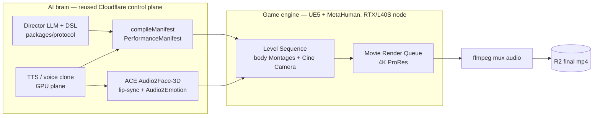
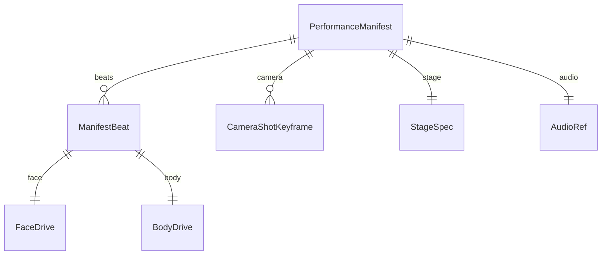
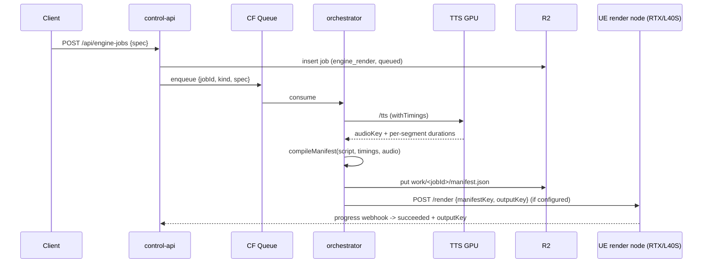

# 3D-Engine Pivot — Offline Cinematic 4K POC

- **Status:** Draft for review
- **Date:** 2026-06-18
- **Project:** LiveAvatarStream
- **Scope of this spec:** The first POC of the 3D-engine pivot — **offline
  cinematic 4K** only. Realtime / Pixel Streaming is designed-for but deferred.

## Context & decision

We are pivoting the avatar pipeline from a **2D generative-video** stack
(MuseTalk / SoulX / EchoMimic + a finishing chain) to a **3D hybrid** where a
game engine owns the visuals and AI owns the performance brain.

- **Engine owns:** body animation, scene/stage, lighting, the virtual camera,
  physics, and recording.
- **AI owns (reused from today):** the brain (our LLM **director + DSL** in
  `packages/protocol`), the **voice** (our TTS / voice clone), **face + emotion +
  lip-sync**, and **on-the-fly body-animation selection**.

**Chosen stack:** **Unreal Engine 5.7 + MetaHuman + NVIDIA ACE Audio2Face-3D**
(open source, **MIT**, self-hosted, **no Riva** — we feed our own TTS audio).
**POC target = offline cinematic 4K first**, rendered via UE **Movie Render
Queue**. Realtime is a later phase.

> **Why offline-first:** it isolates the new, highest-risk pieces (MetaHuman +
> ACE A2F + Sequencer/MRQ + our manifest) without also taking on realtime
> latency, Pixel Streaming, and SFU plumbing. Convai / Inworld (realtime
> conversational NPC stacks) are relevant to the **later realtime phase**, not
> this POC.

## Engine vs AI split



The **PerformanceManifest** is the single contract across the AI/engine boundary
(see "Data contract" below and `packages/protocol/src/manifest.ts`).

## POC scope

One MetaHuman on a lit stage performing a short scripted beat sequence:

1. One MetaHuman (`BP_*`) on a lit stage level `L_Stage` (three-point lighting).
2. Fed **our** TTS audio → **ACE Audio2Face-3D** for lip-sync **and**
   Audio2Emotion facial expression.
3. Our **DSL** triggers **3 body Animation Montages**: `M_Explain`, `M_LeanIn`,
   `M_Nod` (the director's gesture/posture vocabulary collapses onto these).
4. One Sequencer **Cine Camera dolly** move driven by a DSL `camera` cue.
5. Rendered to **4K (3840×2160)** via **Movie Render Queue** (headless).
6. **Audio muxed** into the final mp4 and pushed to R2.

### Exit criteria

- A single **3840×2160** clip with **muxed audio** lands in R2.
- The MetaHuman is **lip-synced** to our TTS via ACE A2F with visible
  **Audio2Emotion** expression that tracks the manifest emotion timeline.
- The **3 montages** fire on the beats that requested them.
- One **Cine Camera dolly** move plays per the manifest camera cue.
- The clip is produced from a control-plane-emitted `manifest.json` with **no
  hand-editing** of the timeline in-engine.

## Data contract — the PerformanceManifest (key codeable artifact)

The manifest is the 3D analogue of the old GPU render call: a fully-resolved,
engine-agnostic JSON timeline compiled from a director DSL `Script` + the
synthesized TTS audio. The engine **plays it back verbatim** — it never
re-interprets the DSL.

Defined as zod + TypeScript in `packages/protocol/src/manifest.ts`; JSON Schema
emitted to `dist/schema/PerformanceManifest.json` (`npm run protocol:schema`).



Per-beat the compiler resolves:

- **timing** — absolute `startS`/`endS`/`audioOffsetS`/`durationS` from the
  running sum of each segment's spoken duration + `pause_ms_after`.
- **face** — DSL `emotion` → ACE A2F emotion + drive `intensity`
  (`EMOTION_TO_A2F`); fed as the emotion timeline to the A2F bake.
- **body** — DSL `gesture`(primary)/`posture`(fallback) → `montageId`
  (`resolveMontage`) plus `lean` + `yawDeg` blend params.
- **camera** — a separate keyframe track; each beat's `camera` cue (shot, move,
  target, easing, intensity) carries forward until overridden, so the engine
  always has a defined shot. Shot → focal length + distance; move → animated
  transform delta; easing → key interpolation (mapping lives in the render
  script, `services/engine/render_from_manifest.py`).

We added a `camera` field to the DSL (`packages/protocol/src/dsl.ts`,
`CameraCue`): enumerated `shot` / `move` / `target` / `easing` + `intensity`.
It is **optional and additive** — the 2D pipeline ignores it.

```jsonc
// manifest.json (abridged)
{
  "version": 1,
  "jobId": "job_…",
  "fps": 24,
  "resolution": { "width": 3840, "height": 2160 },
  "durationS": 12.4,
  "stage": { "level": "L_Stage", "lighting": "three_point_warm", "metahumanId": "BP_Ada" },
  "audio": { "r2Key": "work/job_…/audio.wav", "durationS": 12.4, "sampleRate": 48000 },
  "beats": [
    { "seq": 0, "startS": 0, "endS": 2.1, "audioOffsetS": 0, "durationS": 2.1,
      "text": "Hello — let me show you.", "emphasis": ["show"],
      "face": { "emotion": "warm", "a2fEmotion": "joy", "intensity": 0.35 },
      "body": { "gesture": "wave", "posture": "leaning_in",
                "montageId": "M_Explain", "lean": 0.7, "yawDeg": 0 } }
  ],
  "camera": [
    { "seq": 0, "startS": 0, "durationS": 2.6, "shot": "medium_close",
      "move": "dolly_in", "target": "face", "easing": "ease_in_out", "intensity": 0.5 }
  ]
}
```

## Reuse vs replace

| Component | Decision | Notes |
|---|---|---|
| Cloudflare control plane (`services/control-api`) | **Reuse** | New `engine_render` job kind, additive. |
| LLM director + DSL (`packages/protocol`) | **Reuse + extend** | Added `CameraCue` to the DSL + the `PerformanceManifest` contract. |
| TTS / voice clone (GPU plane) | **Reuse** | Feeds both the manifest audio ref and the ACE A2F bake. Needs a small extension to return per-segment timings (falls back to a words/sec estimate). |
| R2 storage + Durable Object job events | **Reuse** | Manifest + audio + final mp4 all live in R2; job status over the existing DO/webhook. |
| **MuseTalk / SoulX / EchoMimic** talking-head | **Retire** (this path) | Replaced by MetaHuman + ACE A2F. |
| 2D **finishing chain** (RIFE/upscale) | **Retire** (this path) | MRQ renders native 4K; only an ffmpeg audio mux remains. |
| Face / emotion / lip-sync | **Replace** | Now NVIDIA ACE Audio2Face-3D (MIT, self-hosted). |
| Body animation | **Replace** | Now hand-authored MetaHuman Animation Montages, selected by DSL. |
| Camera / stage / lighting / recording | **New (engine)** | UE Sequencer Cine Camera + lit level + Movie Render Queue. |

The 2D model services are **left untouched**; this path is additive alongside
`offline_render`.

## Control-plane integration

`engine_render` mirrors the existing `offline_render` job pattern:



- Producer: `POST /api/engine-jobs` (`services/control-api/src/routes/engine.ts`).
- Consumer: `runEngineRender` in `orchestrator.ts` (TTS → compile → persist →
  dispatch). The UE node owns the terminal transition via the existing progress
  webhook, exactly like `offline_render` hands finishing the terminal state.
- Optional `UE_RENDER_NODE_URL` env: unset, the job still compiles + persists the
  manifest and parks at `rendering` for manual pickup — so the codeable pipeline
  runs end-to-end without a render box.
- New additive statuses: `compiling`, `rendering`.

## GPU / infra plan

| Stage | GPU | Rationale |
|---|---|---|
| UE5 MRQ render | **RTX 4090 / RTX 6000 Ada / L40S** | UE needs ray tracing **and a display/encode engine**. **NOT H100** (no NVENC/display engine). |
| ACE Audio2Face-3D | RTX-class / **L40S** (H100/L40S OK for pure inference) | A2F local-execution provider runs on-device; can co-locate or run separately. |
| TTS / voice clone | existing H100/L40S plane | Unchanged. |

Rough cost: **L40S ≈ $1.5–2.5/hr** on-demand; a short 4K path-traced clip
renders in single-digit minutes → **well under $1** of GPU time per POC clip plus
setup/idle. Full runbook + versions + accounts: `services/engine/POC_SETUP.md`.

> **ACE/UE version caveat:** the NVIDIA ACE Unreal plugin v2.5 officially targets
> **UE 5.5 / 5.6**. For **UE 5.7**, either rebuild the MIT-licensed plugin from
> source or fall back to UE 5.6 for the POC. The manifest + render script are
> engine-version-agnostic.

## Risks & mitigations

- **ACE plugin vs UE 5.7 mismatch** — MIT source rebuild, or fall back to 5.6.
- **A2F ↔ MetaHuman face mapping** — use NVIDIA's `mh_arkit_mapping_pose_A2F`.
- **UE Python API drift across versions** — render script isolates all UE calls;
  the manifest contract is stable. Adjust calls per the in-editor API reference.
- **Per-segment TTS timings unavailable** — manifest compiler falls back to a
  deterministic words/sec estimate so timing stays coherent.
- **H100 misused for render** — explicitly called out; route render to RTX/L40S.

## Phasing

1. **Phase 1 (this spec):** offline cinematic 4K — manifest contract +
   `engine_render` job + UE render script + first 4K clip.
2. **Phase 2 (deferred):** richer scene (multi-cam, props, physics), longer
   scripts, automated A2F bake in the dispatch path.
3. **Phase 3 (deferred):** **realtime** — UE Pixel Streaming + realtime ACE A2F;
   evaluate Convai / Inworld for conversational NPC behavior. Reuse the same DSL
   + manifest where possible.

## What's done in-repo vs needs a UE workstation

**Done in-repo (typechecked, additive):**

- `CameraCue` added to the DSL + the `PerformanceManifest` schema + a pure
  `compileManifest` compiler (with tests) in `packages/protocol`.
- `engine_render` job kind, `EngineRenderSpec`, producer route, and orchestrator
  consumer (TTS → compile → persist → dispatch stub) in `services/control-api`.
- UE5 Movie Render Queue render script + README + this runbook in
  `services/engine` (best-effort, untested without UE).

**Needs a UE5 + RTX/L40S workstation (see `services/engine/POC_SETUP.md`):**

- Install UE5.7 (or 5.6) + the ACE Audio2Face-3D plugin + MetaHuman.
- Build `L_Stage` + lighting, place the MetaHuman, author the 3 montages.
- Wire/bake ACE A2F to the MetaHuman face from our TTS audio.
- Run `render_from_manifest.py` headless and ffmpeg-mux the result.
