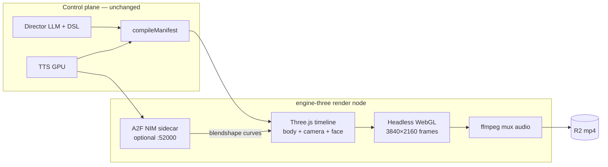

# Three.js Engine Pivot — Offline Cinematic 4K POC

- **Status:** Active (replaces UE as primary render path)
- **Date:** 2026-06-19
- **Project:** LiveAvatarStream3D
- **Supersedes:** `2026-06-18-3d-engine-poc.md` (UE5 + MetaHuman + MRQ) for **render execution**; the manifest contract and control-plane integration are unchanged.
- **Scope:** Offline cinematic 4K first; realtime WebRTC is Phase 3 on the same scene graph.

## Decision

We pivot the **render engine** from Unreal Engine 5 to **Three.js** because:

- UE official containers and `ue4-full` builds are high-friction on RunPod/Linux.
- Three.js runs in a lightweight Node + headless WebGL stack on the **H100 GPU pod** (co-located with voice/TTS).
- Realtime (Phase 3) maps naturally to browser WebRTC — no Pixel Streaming infra.
- **`PerformanceManifest`** remains the engine-agnostic hand-off; only the render adapter changes.

**What we keep:** director DSL, TTS, `compileManifest`, `engine_render` job, R2 storage, progress webhooks.

**What we replace:** UE Editor, MetaHuman, Movie Render Queue → Three.js scene + frame capture + ffmpeg mux.

**Face drive:** self-hosted **ACE Audio2Face-3D NIM** sidecar when configured; amplitude + emotion fallback otherwise.

## Architecture



## Engine vs AI split

Same as the UE spec: AI owns brain + voice + manifest compilation; the render node owns body animation playback, stage/lighting, virtual camera, and recording.

| Layer | Owner |
|---|---|
| Director DSL + `PerformanceManifest` | Control plane (`packages/protocol`) |
| TTS / voice clone | GPU plane (unchanged) |
| Lip-sync + emotion | A2F NIM (preferred) or fallback jaw/envelope |
| Body montages | glTF skeletal clips (`M_Explain`, `M_LeanIn`, `M_Nod`) |
| Camera | Manifest `camera` keyframes → `PerspectiveCamera` |
| Stage / lighting | Three.js scene + HDRI / three-point rig |
| Offline 4K mp4 | Frame capture + ffmpeg |

## POC scope (unchanged exit criteria, adapted quality bar)

1. One avatar (glTF/VRM with ARKit morph targets, or bundled placeholder) on a lit stage.
2. TTS audio → A2F NIM lip-sync + emotion timeline from manifest beats.
3. Three body animation clips fired per beat `montageId`.
4. One camera dolly move from manifest `camera` cue.
5. Rendered **3840×2160** via headless WebGL frame capture.
6. Audio muxed into final mp4 in R2.

**Quality note:** output is real-time PBR cinematic, not MetaHuman + path-traced MRQ. Exit criteria focus on **correct manifest playback** and **visible lip-sync/emotion**, not film-grade MetaHuman fidelity.

## Data contract

No schema change. `PerformanceManifest` in `packages/protocol/src/manifest.ts` is unchanged.

Field mapping:

| Manifest field | Three.js adapter |
|---|---|
| `stage.avatarId` | Avatar asset id → `assets/avatars/<id>.glb` |
| `stage.lighting` | Named preset in `scene.ts` |
| `beats[].body.montageId` | `AnimationMixer` clip name |
| `beats[].face` | A2F emotion drive + intensity |
| `camera[]` | Camera keyframe track |
| `audio.r2Key` | Downloaded wav for A2F + ffmpeg mux |

## Render node API

Mirrors the UE stub the orchestrator already calls:

```http
POST /render
Authorization: Bearer <INTERNAL_SERVICE_TOKEN>
Content-Type: application/json

{ "jobId": "job_…", "manifestKey": "work/job_…/manifest.json", "outputKey": "job_….mp4" }
```

Returns **202 Accepted**; progress and terminal status via `/api/internal/jobs/progress` webhook.

## Infra

| Component | Host |
|---|---|
| `engine-three` | H100 GPU pod (Node 20+, ffmpeg, nginx `/engine-three/` on :8080) |
| A2F NIM | Same pod (localhost:52000) when VRAM allows |
| TTS | Same H100 GPU plane |

Env vars: see `services/engine-three/POC_SETUP.md`.

## Phasing

1. **Phase 1 (this spec):** offline 4K manifest render + first clip in R2.
2. **Phase 2:** richer assets (VRM/RPM avatars), automated A2F bake in dispatch path, multi-cam.
3. **Phase 3:** same Three.js scene in browser + WebRTC to Cloudflare SFU (realtime).

## UE path status

`services/engine/` (UE Python render script) is **archived reference**. Do not invest in UE container builds unless we explicitly revert.
