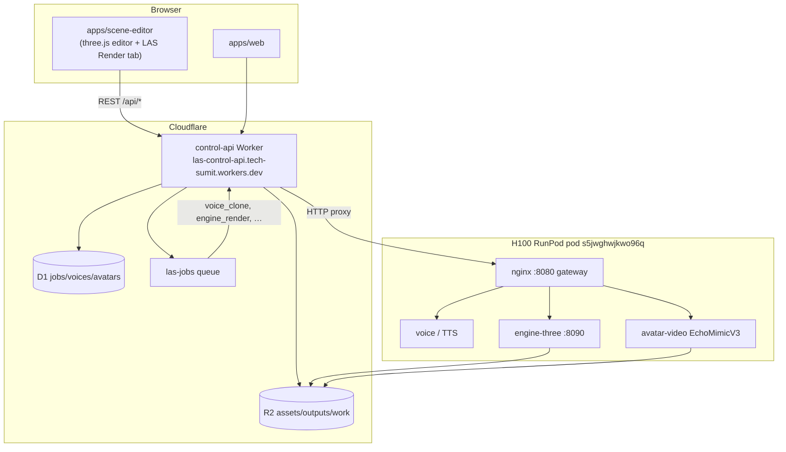

# LiveAvatarStream3D — Project context

**Date:** 2026-06-20  
**Repo:** `projects/LiveAvatarStream3D` (monorepo workspace under `n8n/projects/`)

## What we are building

An open-source **HeyGen-style avatar video pipeline**:

1. **Upload / clone** — user video → avatar build; voice sample → GPU voice clone
2. **Script** — performance DSL (emotions, gestures, camera cues)
3. **Render** — offline 1080p/4K mp4 on an **H100 RunPod** GPU plane
4. **Realtime (future)** — MuseTalk + Cloudflare SFU for live sessions

Two render paths share the same control plane:

| Path | Engine | Status |
|---|---|---|
| **2D cinematic** | EchoMimicV3 + GFPGAN + RIFE | ✅ Validated Jun 18, 2026 ("Urwashi" 1920×1080 mp4) |
| **3D cinematic** | `engine-three` (Three.js headless WebGL) | ✅ Validated Jun 19, 2026 (`validate_engine_render.py` PASS) |
| **Realtime** | MuseTalk + XTTS streaming + SFU | Code present; gated on Cloudflare Realtime secrets |

## Architecture



### Control plane (`services/control-api`)

- Cloudflare Worker + D1 + R2 + queue consumer
- Orchestrates: TTS → `compileManifest()` → dispatch render to pod
- `GPU_PROVIDER_BASE_URL` in `wrangler.toml` points at live pod gateway

### GPU plane (`services/gpu/`)

- Python uvicorn services behind nginx on pod `:8080`
- Weights on `/workspace` network volume (persists across pod stop/start)
- `engine-three` co-located on same pod (Node 20 + headless `gl` + Xvfb)

### Protocol (`packages/protocol`)

- `Script` / DSL — beats, emotions, gestures, camera cues
- `PerformanceManifest` — engine-agnostic hand-off after TTS
- `SceneDocument` — editor scene graph (camera, avatar, lights, props)
- `EngineRenderSpec` — `POST /api/engine-jobs` payload (script + optional `scene`)

## Scene editor initiative (Jun 19–20, 2026)

**Goal:** Unity/Blender-like authoring in the browser; **WYSIWYG** export to H100 render.

### History

1. **Phase A** — Custom React + Three.js editor (`apps/scene-editor/src/`)
   - Built for tight `@las/protocol` integration, voice panel, viewport camera capture
   - Preserved on git branch **`backup/custom-scene-editor`** (commit `bd2d5cb`)

2. **Phase B (current, uncommitted on `main`)** — Extend official [three.js editor](https://github.com/mrdoob/three.js/tree/master/editor)
   - Full upstream editor (import GLB, lights, materials, undo, etc.)
   - Thin LAS layer: **`Render` sidebar tab** — voice dropdown, single script line, Record → API
   - Export bridge: viewport camera + tagged objects → `SceneDocument` → `EngineRenderSpec`

**Why switch?** The official editor already solves scene authoring; we only need a render launcher + protocol bridge, not a second editor from scratch.

## WYSIWYG render path

When `EngineRenderSpec.scene` is set:

1. Editor → `sceneToEngineRenderSpec()` → `POST /api/engine-jobs`
2. Orchestrator: TTS → `compileManifest({ scene: spec.scene })` → R2 `work/{jobId}/manifest.json`
3. Pod `engine-three POST /render` reads manifest
4. If `manifest.scene` present → `setupEditorScene()` + frozen camera + `applyTimelineFaceOnly`
5. If missing (old pod build) → legacy `applyTimeline()` reframes procedural placeholder at origin

**Known gap:** Pod was not fully synced with latest `engine-three` WYSIWYG build at last session. Local code has Lee Perry-Smith GLB + decal lip-sync; pod may still show placeholder stick figure until `sync-engine-three.sh` completes and health shows `wysiwygScene: true`.

## Git state (Jun 20, 2026)

| Branch | Contents |
|---|---|
| `main` | Initial commit + merge of engine-three pipeline from backup; **three.js editor migration uncommitted** |
| `backup/custom-scene-editor` | Full React editor, protocol scene graph, control-api engine routes, engine-three WYSIWYG |
| `origin/main` | Initial commit only (local `main` is ahead) |

Uncommitted on `main`: three.js editor tree, `js/las/*`, `Sidebar.LAS.js`, `DELETE /api/voices/:id`, package-lock three 0.184.

## Live infra (as of last session)

| Resource | Value |
|---|---|
| Control API | `https://las-control-api.tech-sumit.workers.dev` |
| Pod ID | `s5jwghwjkwo96q` |
| Pod gateway | `https://s5jwghwjkwo96q-8080.proxy.runpod.net` |
| Pod SSH | `root@213.181.105.227:11422` (key: `~/.ssh/las_runpod`) |
| Pod LAS root | `/workspace/las` |
| engine-three on pod | `/workspace/las/services/engine-three` |

## Validation already done

See `progress.md` for full detail. Summary:

- **Jun 18** — Offline 2D path: real 1920×1080 Urwashi mp4, health round-trip green
- **Jun 19** — 3D `engine_render`: `validate_engine_render.py` PASS on live H100
- **Jun 19–20** — Editor manifests verified correct (`scene` with camera rotation, `lee_perry_smith`); MP4 mismatch traced to **stale pod binary**, not bad editor data

## Key files map

```
LiveAvatarStream3D/
├── apps/scene-editor/          # three.js editor + js/las/ bridge
├── packages/protocol/          # SceneDocument, EngineRenderSpec, manifest
├── services/control-api/       # Worker routes, orchestrator, queue
├── services/engine-three/      # Headless render node
├── services/gpu/               # Python GPU services + deploy/
├── scripts/gpu/                # spawn-pod, sync-engine-three, health-roundtrip
└── docs/specs/                 # This folder
```
