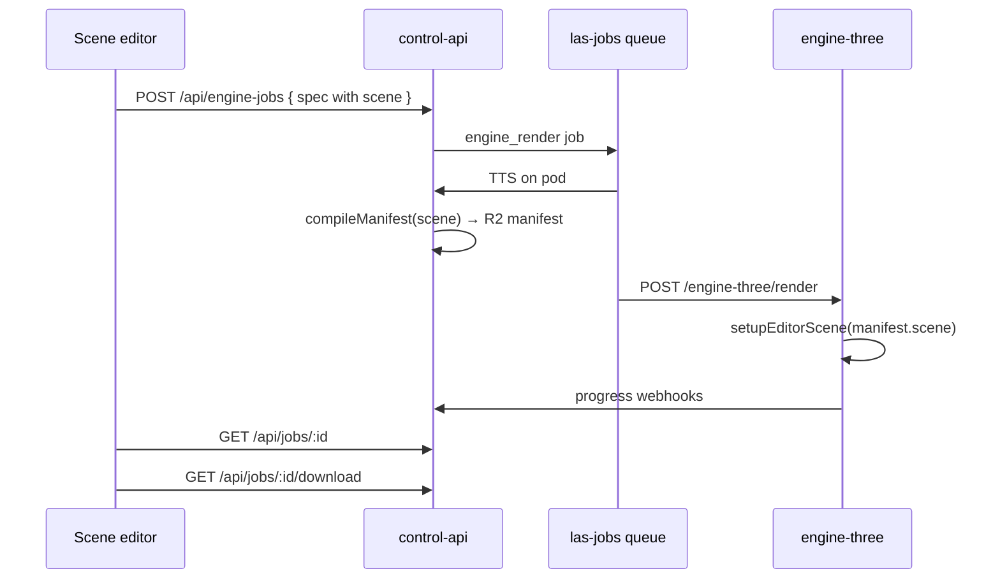

# Scene editor — three.js editor + LAS integration

**Date:** 2026-06-20  
**Status:** Implemented locally; uncommitted on `main`  
**Supersedes:** `docs/scene-editor-architecture.md` (React editor description)

## Decision

Extend the official [three.js editor](https://github.com/mrdoob/three.js/tree/master/editor) instead of maintaining a custom React editor.

| | Custom React editor | three.js editor + LAS |
|---|---|---|
| Branch | `backup/custom-scene-editor` | `main` (working tree) |
| Scene authoring | Hand-rolled viewport/graph/inspector | Full upstream editor |
| LAS features | Voice panel, multi-beat script, React state | **Render** tab only |
| Maintenance | High — duplicate editor UX | Low — vendor editor, thin bridge |

## App layout

```
apps/scene-editor/
├── index.html              # Bootstraps three.js editor + initLasEditor()
├── vite.config.ts          # Port 5174; three/addons aliases
├── js/                     # Upstream editor (Sidebar, Viewport, Loader, …)
├── js/las/                 # LAS integration layer
│   ├── api.js              # control-api client
│   ├── exportScene.js      # editor → SceneDocument → EngineRenderSpec
│   ├── voices.js           # Dedupe + POC duplicate detection
│   ├── LasSceneSeed.js     # Default Lee Perry-Smith + lights
│   └── LasBootstrap.js     # Empty-scene seed hook
├── js/Sidebar.LAS.js       # Render tab UI
├── css/las.css             # Render tab styles
└── public/avatars/         # Lee Perry-Smith GLB, decal, michelle, xbot
```

**Dependencies:** `three@^0.184`, `three-gpu-pathtracer`, `three-mesh-bvh`, `@las/protocol`

## Render tab (`Sidebar.LAS.js`)

| Control | Behavior |
|---|---|
| Voice dropdown | Lists **deduped ready** voices (newest wins per normalized label) |
| Refresh voices | `GET /api/voices?userId=demo-user` |
| Delete duplicate POC voices | `DELETE /api/voices/:id` for older duplicates (needs Worker deploy) |
| Script textarea | **Single beat** — default `"Hello, welcome to the demo."` |
| Record | Builds spec → `POST /api/engine-jobs` → polls job status |
| Job panel | Full job id, download MP4 link, manifest JSON link |

### Voice dedupe rules (`js/las/voices.js`)

- **Dropdown:** one ready voice per normalized label (trim, lowercase, collapse spaces)
- **Delete candidates:** older rows sharing a label; extra POC labels matching `engine poc`, `poc voice`, `untitled voice`, etc.

## Export bridge (`js/las/exportScene.js`)

Maps live editor state → `@las/protocol`:

1. **Camera** — always `editor.camera` (viewport camera after orbit). This is the WYSIWYG render camera.
2. **Avatar** — objects tagged with `userData.lasAvatarId` (seed sets `lee_perry_smith`)
3. **Lights** — objects with `userData.lasLightType` (`directional`, `ambient`, …)
4. **Fallback** — if no tagged avatar, defaults to `lee_perry_smith` at origin

```javascript
buildEngineRenderSpec(editor, voiceId, scriptText)
  → editorToSceneDocument(editor)
  → buildSingleBeatScript(text)   // one beat, no POC multi-line clutter
  → sceneToEngineRenderSpec(doc, voiceId, script, 24)
```

Output resolution: 1920×1080 @ 24fps (protocol defaults).

## Default scene seed (`LasSceneSeed.js`)

On first empty project:

- Background `#1a2030`
- Lee Perry-Smith bust from `/avatars/LeePerrySmith/LeePerrySmith.glb`
- Key + fill lights
- Camera at `(0, 1.6, 2)` looking at face height

Also runs after **File → New** (`editorCleared` signal).

## API client (`js/las/api.js`)

| Method | Route |
|---|---|
| `listVoices()` | `GET /api/voices` |
| `deleteVoice(id)` | `DELETE /api/voices/:id` |
| `createEngineJob(spec)` | `POST /api/engine-jobs` |
| `getEngineJob(id)` | `GET /api/jobs/:id` |
| `engineJobDownloadUrl(id)` | `/api/jobs/:id/download` |
| `engineJobManifestUrl(id)` | `/api/engine-jobs/:id/manifest` |

Base URL: `import.meta.env.VITE_API_URL`  
User: hardcoded `demo-user` (same as web app POC)

## Record pipeline (end-to-end)



### Manifest timing

- During `tts` / early statuses: manifest may **not exist** yet
- Written during `compiling` → `rendering`
- Use **full** job id (`job_mqlg8hks28a55068fcd0`), not truncated prefix, for R2 lookup
- `GET /api/engine-jobs/:id/manifest` supports prefix match + returns hint when not ready

## Sidebar integration

`js/Sidebar.js` adds tab order:

1. **Render** (LAS) — default selected
2. Scene
3. Project
4. Settings

## Restoring the React editor

```bash
git checkout backup/custom-scene-editor -- apps/scene-editor
# or work on that branch directly
```

Commit `bd2d5cb` has the full React implementation including VoicePanel clone UI, multi-beat script, viewport camera capture, debug instrumentation.

## Not yet in three.js editor (backlog)

- Voice **clone** UI (record/upload sample) — was in React `VoicePanel`; use web app or API for now
- Multi-beat script / timeline — intentionally single-line for POC
- R2 scene CRUD (`GET/POST /api/scenes`)
- GPU authoritative preview (`POST /preview` on pod)
- MJPEG / WebRTC live viewport
- Auto-tag imported GLB as avatar/prop via inspector UI

See [2026-06-20-next-steps.md](./2026-06-20-next-steps.md).
