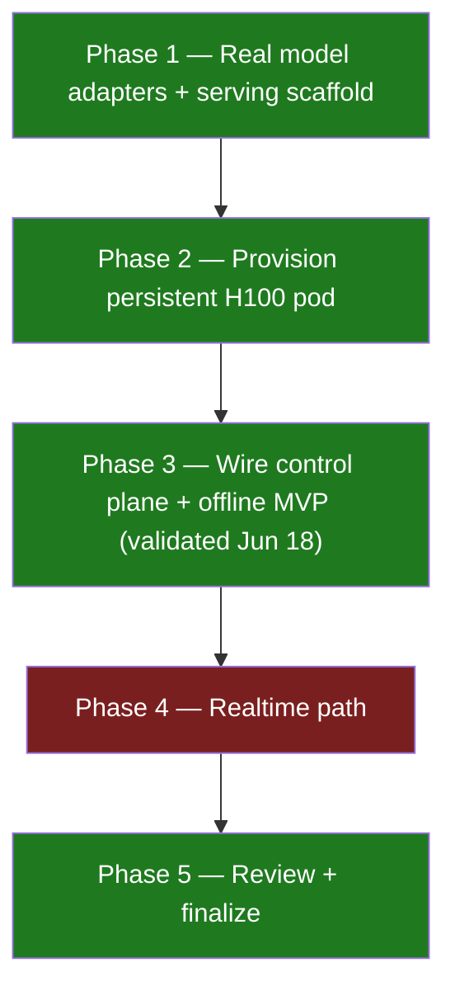

# LiveAvatarStream — progress & single source of truth

> **Scene editor / WYSIWYG / three.js migration:** see [`docs/specs/README.md`](docs/specs/README.md)
> (Jun 20, 2026). This file remains authoritative for GPU validation history.

This document is the authoritative status of the GPU-plane real-model integration
(plan: *GPU plane real models*). Where the original plan and the implementation
diverged, **this document wins** — see [Plan-vs-implementation drift](#plan-vs-implementation-drift).

## TL;DR

- ✅ **VALIDATED on a live H100 (Jun 18, 2026):** the offline 1080p **"demo-ref"**
  render produced a real **1920×1080 mp4** in R2, and **both health legs**
  (direct pod gateway + deployed-Worker round-trip) were green. See
  [Live validation](#live-validation-jun-18-2026).
- The **offline render path is fully implemented and wired** end to end: upload →
  build avatar **"demo-ref"** → clone voice → `voice/tts` → `avatar-video/render`
  (EchoMimicV3) → `finishing` (GFPGAN + Real-ESRGAN + RIFE) → **1920×1080 mp4** in R2.
- The **realtime path is implemented** (MuseTalk worker + XTTS-v2 streaming +
  Cloudflare SFU wiring) but is **gated on Cloudflare Realtime secrets** and a
  live session to fully validate.
- **Everything model-heavy requires a live H100 pod.** The repo is reproducible
  (`install_deps.sh` → `seed_weights.sh` → `setup_musetalk.sh` → `start.sh`), but
  nothing in this repo fabricates render output, pod IDs, or health responses.
- Two ready-to-run validators ship here: `services/gpu/deploy/validate_offline.py`
  (offline 1080p e2e) and `scripts/gpu/health-roundtrip.sh` (gateway + Worker
  round-trip). See [How to verify](#how-to-verify).
- **3D engine path (Jun 2026):** ✅ **VALIDATED on live H100 (Jun 19, 2026):**
  `engine_render` → `services/engine-three` produced a real **1920×1080 mp4** in R2
  (`validate_engine_render.py` PASS). Pod `s5jwghwjkwo96q`, gateway
  `https://<pod-id>-8080.proxy.runpod.net`. Requires Xvfb + headless `gl`.
  Spec: `docs/specs/2026-06-20-project-context.md`.

## Phase status



| Phase | Item | Status | Notes |
|---|---|---|---|
| 1 | EchoMimicV3 adapter (`avatar-video/models.py`, `dsl_map.py`) | **Done (code)** | Real upstream inference via `ECHOMIMIC_PYTHON` venv; needs pod weights to run. |
| 1 | Serving scaffold (`deploy/{nginx.conf,supervisord.conf,start.sh}`) | **Done** | 6 uvicorns + nginx gateway on `:8080`. avatar-build on **`:8011`** (see drift). |
| 1 | Weights seed (`deploy/seed_weights.sh`, `WEIGHTS.md`) | **Done (code)** | Populates `/workspace` volume; must run once on the pod. |
| 2 | Provision pod + volume (`scripts/gpu/spawn-pod.sh`) | **Validated (live, Jun 18)** | Idempotent RunPod REST provisioner; H100 pod brought up and ran the offline e2e. |
| 2 | Pod bring-up (`deploy/install_deps.sh`, `POD_SETUP.md`) | **Validated (live, Jun 18)** | Reproducible interpreter/venv layout. **Resume note:** container disk is wiped + env not re-injected on resume, so `install_deps.sh` must re-run — see `POD_SETUP.md` → *Resuming a stopped pod*. |
| 3 | Wire Worker (`wrangler.toml` `GPU_PROVIDER_BASE_URL`) | **Validated (live, Jun 18–19)** | Round-trip green; pod reprovisioned Jun 19 (`s5jwghwjkwo96q`). |
| 3 | Offline e2e (`deploy/validate_offline.py`) | **Validated (live, Jun 18)** | Produced a real 1920×1080 "demo-ref" mp4 in R2. |
| 4 | Cloudflare SFU realtime (`realtime.ts`) | **Code present, gated** | App id/TURN key id in `wrangler.toml`; **needs `CF_REALTIME_APP_SECRET` + `CF_TURN_KEY_API_TOKEN`**. |
| 4 | MuseTalk realtime (`realtime/`, `deploy/setup_musetalk.sh`) | **Done (code)** | Validate with `realtime/validate_musetalk.py` on the pod. |
| 5 | Finalize (this `progress.md` + verify scripts) | **Done** | — |

## What is real vs. what needs a live pod

**Real and verifiable in-repo (no GPU):**
- All TypeScript (`control-api`, `protocol`, `apps/web`) typechecks.
- Python services import cleanly (model deps are lazy-loaded).
- Deploy scripts are syntax-clean and idempotent.
- The offline HTTP contract: `validate_offline.py` exercises exactly the routes
  the web app uses (`/api/uploads`, `/api/avatars`, `/api/voices`, `/api/jobs`).

**Needs a live H100 pod + secrets (cannot be faked):**
- Any actual avatar build, voice clone, render, or realtime session.
- The 1080p "demo-ref" mp4 (only produced by a real EchoMimicV3 + finishing run).
- The Worker→pod health round-trip (requires the deployed Worker + reachable pod).

The offline items above were **exercised live on Jun 18, 2026** (the avatar build,
voice clone, the 1080p "demo-ref" render, and the Worker↔pod health round-trip all
ran on a real H100). Realtime remains gated on Cloudflare Realtime secrets.

## Live validation (Jun 18, 2026)

A live H100 pod run proved the offline pipeline end to end:

- **Offline render:** `validate_offline.py` produced a **real 1920×1080 mp4** of
  avatar **"demo-ref"** in R2 (full chain: build → voice clone → `voice/tts` →
  `avatar-video/render` EchoMimicV3 → `finishing` GFPGAN + Real-ESRGAN + RIFE).
- **Health round-trip:** both legs green — the **direct pod gateway** check and
  the **deployed-Worker → pod** round-trip (`health-roundtrip.sh`).
- **Job id pattern:** jobs are keyed `job_<base36-timestamp><12-hex>` (e.g.
  `job_lk3p9q…`), produced by `newId('job')`; avatars use `av_…`, voices `vo_…`.
  The offline render job is enqueued on `las-jobs` and tracked in the D1 `jobs`
  table; the finishing service drives it to `succeeded` via the progress webhook.

### Fixes folded back into the repo from the live run

- **Voice-clone reliability fix:** `POST /api/voices` previously ran the clone in
  `c.executionCtx.waitUntil(...)`, which Cloudflare kills once the response
  returns — so `/voice/clone` often never reached the pod and the row stayed
  `cloning` until timeout. It now enqueues a durable **`voice_clone`** job on
  `las-jobs` (mirroring `offline_render`/`avatar_build`); the queue consumer calls
  the pod and flips the D1 row to `ready`/`failed`. The API response is unchanged
  (returns the voice id immediately with status `cloning`).
- **Resume reproducibility:** `install_deps.sh` now pins `ml_dtypes==0.5.4` inside
  the EchoMimicV3 venv (onnx `float4_e2m1fn`) and installs an idempotent
  `torchvision.transforms.functional_tensor` shim for basicsr/gfpgan/realesrgan.
  `POD_SETUP.md` documents that RunPod wipes the container disk + drops env vars on
  resume, so `install_deps.sh` must re-run (weights/venvs on `/workspace` persist).

## Known stubs / limitations

- **`avatar-build/pipeline.py` `_maybe_fine_tune`** — per-avatar LoRA fine-tune.
  Imports a `trainer` module that only exists in a prod training image; absent
  that, it is guarded to return `False` so the base build never fails. **Left as
  a stub on purpose** — completing it requires an external LoRA trainer + curated
  training data that are out of scope here. `fineTune` defaults to `false`, so the
  offline MVP path does not depend on it.
- **`voice/engines.py` `FishS2Engine`** — Fish Audio S2 is served externally via
  SGLang; without that endpoint it **transparently falls back to XTTS-v2**. The
  offline render therefore still produces real cloned-voice audio with the default
  `fish_s2` selection. Implementing native Fish S2 requires standing up the SGLang
  Fish S2 server (external model) — **left as a documented fallback**.
- **Realtime is gated** on Cloudflare Realtime credentials (`CF_REALTIME_APP_SECRET`,
  `CF_TURN_KEY_API_TOKEN`). The code path exists; a live WebRTC session cannot be
  validated until those secrets are set.

## Pod lifecycle & cost control

The H100 pod is the only metered resource. **Stop it the moment you are done.**

```mermaid
stateDiagram-v2
    [*] --> RUNNING: spawn-pod.sh
    RUNNING --> EXITED: stop (keeps volume, no GPU $)
    EXITED --> RUNNING: start
    RUNNING --> TERMINATED: delete (frees pod; volume billed separately)
    EXITED --> TERMINATED: delete
    TERMINATED --> [*]
```



Provision / inspect (idempotent — reuses an existing `las-h100` pod + `las-models` volume):

```bash
./scripts/gpu/spawn-pod.sh          # provision or report
./scripts/gpu/spawn-pod.sh --info   # just print connection details (POD_ID, GATEWAY_URL, cost/hr)
```

Stop / start / terminate via the RunPod REST API (the same API `spawn-pod.sh` uses).
`RUNPOD_API_KEY` is loaded from `.env`; `POD_ID` comes from `spawn-pod.sh --info`:

```bash
REST=https://rest.runpod.io/v1
AUTH="Authorization: Bearer ${RUNPOD_API_KEY}"

# STOP — pauses the pod, releases the GPU, stops GPU billing. Volume persists.
curl -sS -X POST -H "$AUTH" "${REST}/pods/${POD_ID}/stop"

# START — resume a stopped pod (subject to H100 availability in its datacenter).
curl -sS -X POST -H "$AUTH" "${REST}/pods/${POD_ID}/start"

# TERMINATE — delete the pod entirely. The network volume is NOT deleted by this
# (it keeps the seeded weights and is billed for storage until removed separately).
curl -sS -X DELETE -H "$AUTH" "${REST}/pods/${POD_ID}"
```

**Cost levers:**
- **Stop the pod between work sessions** — biggest saver; the seeded `/workspace`
  volume persists so the next `start` skips re-downloading weights.
- The `las-models` network volume (~300 GB) is billed for storage even while the
  pod is stopped. Delete it only if you are done with the project; re-seeding is slow.
- Prefer the `fast` tier (EchoMimicV3-Flash) for iteration; reserve `premium` for
  final renders.
- See also `OPERATIONS.md` → *Cost levers*.

## How to verify

Run the cheap checks first (no GPU), then the live ones (need a pod + secrets).

```bash
# 0) In-repo sanity (no GPU): TS typecheck + Python compiles.
npm run typecheck
python3 -m py_compile services/gpu/deploy/validate_offline.py services/gpu/deploy/validate_engine_render.py

# 1) Health round-trip — pod gateway AND deployed Worker.
#    Needs GPU_PROVIDER_BASE_URL (+ optional GPU_PROVIDER_TOKEN) and CONTROL_API_URL.
./scripts/gpu/health-roundtrip.sh            # both checks
./scripts/gpu/health-roundtrip.sh --direct   # pod gateway only
./scripts/gpu/health-roundtrip.sh --worker   # deployed Worker round-trip only

# 2) Offline 1080p e2e — builds avatar "demo-ref" from demo_video.mp4 and asserts a
#    real 1920x1080 mp4 comes back. Needs a live pod + deployed Worker.
CONTROL_API_URL=https://las-control-api.<acct>.workers.dev \
  python3 services/gpu/deploy/validate_offline.py \
    --video demo_video.mp4 --out /tmp/demo-ref_offline.mp4

# 3) Realtime MuseTalk generation (on the pod, no SFU needed) — once an avatar +
#    voice exist (use the ids printed by validate_offline.py):
#    cd services/gpu/realtime && PYTHONPATH=../common python3 validate_musetalk.py \
#      --avatar-prefix demo-user/<av_id> --voice-prefix demo-user/<vo_id> --out /workspace/mt.mp4

# 4) 3D engine_render e2e (Three.js on H100 pod) — needs live pod + engine-three
#    built via install_deps.sh §8 and Worker deployed with engine_render path.
CONTROL_API_URL=https://las-control-api.<acct>.workers.dev \
  python3 services/gpu/deploy/validate_engine_render.py \
    --video demo_video.mp4 --out /tmp/engine_poc.mp4

# Pod resume after stop (RunPod wipes container disk — see POD_SETUP.md):
#   ./scripts/gpu/resume-pod.sh --print
```

### Remaining manual steps to reach 100% (require live infra / secrets)

1. `RUNPOD_API_KEY=… ./scripts/gpu/spawn-pod.sh` — provision the H100 pod + volume.
2. On the pod (`POD_SETUP.md`): `install_deps.sh` → `seed_weights.sh` →
   `setup_musetalk.sh` → set `pod.env` → `start.sh`.
3. Set Worker secrets and deploy:
   ```bash
   cd services/control-api
   wrangler secret put GPU_PROVIDER_TOKEN
   wrangler secret put INTERNAL_SERVICE_TOKEN
   # realtime only:
   wrangler secret put CF_REALTIME_APP_SECRET
   wrangler secret put CF_TURN_KEY_API_TOKEN
   wrangler deploy
   ```
   Confirm `GPU_PROVIDER_BASE_URL` in `wrangler.toml` matches the live pod gateway.
4. `./scripts/gpu/health-roundtrip.sh` → expect `PASS`.
5. `python3 services/gpu/deploy/validate_offline.py --api <worker-url>` → expect
   `PASS: real 1920x1080 offline render of 'demo-ref' produced`.
6. **3D engine path:** resume pod (`./scripts/gpu/resume-pod.sh`), confirm
   `engine-three/health` via `health-roundtrip.sh --direct`, then run
   `validate_engine_render.py` → expect `PASS` with ≥1280×720 mp4.
7. (Realtime) run `validate_musetalk.py` on the pod, then a live browser session.

## Scene editor initiative (Jun 19–20, 2026)

**Full context:** [`docs/specs/2026-06-20-scene-editor-threejs.md`](docs/specs/2026-06-20-scene-editor-threejs.md)

| Item | Status |
|---|---|
| `SceneDocument` schema (`@las/protocol`) | **Done** |
| Custom React editor | **On branch `backup/custom-scene-editor`** |
| **three.js editor + LAS Render tab** | **Done locally (uncommitted on `main`)** |
| Record → `POST /api/engine-jobs` with WYSIWYG `scene` | **Wired** |
| Pod WYSIWYG render (Lee bust, not placeholder) | **Blocked — pod sync pending** |
| R2 scene CRUD, GPU preview, live stream | **TODO — see specs next-steps** |

Run: `npm run dev:editor` → http://localhost:5174

## Plan-vs-implementation drift

The implementation intentionally diverged from the original plan; trust this file:

- **Realtime transport: Cloudflare SFU (Calls), not raw WHIP/WHEP to the GPU.**
  The browser publishes/subscribes against the Cloudflare SFU; the GPU worker
  joins the same SFU. `wrangler.toml` carries `CF_REALTIME_APP_ID` + `CF_TURN_KEY_ID`
  (non-secret); the secrets are `CF_REALTIME_APP_SECRET` + `CF_TURN_KEY_API_TOKEN`.
- **`avatar-build` runs on `:8011`, not `:8001`.** It was moved off the contiguous
  `8001-8006` block to avoid a pod port clash. `nginx.conf` / `supervisord.conf` /
  `POD_SETUP.md` reflect `:8011`; `provider.ts` path routing (`/{service}{path}`)
  is unaffected because nginx maps `/avatar-build/` → `:8011` internally.
- **GPU provider is RunPod (persistent pod), not Modal**, for both offline and
  realtime. `GPU_PROVIDER=runpod` in `wrangler.toml`. The `provider.ts` HTTP shape
  is provider-agnostic, so this is a config choice only.
- **Two extra Python interpreters on the pod** (EchoMimicV3 venv + MuseTalk venv)
  because of irreconcilable `transformers`/`diffusers`/`torch` pins — see
  `POD_SETUP.md`. Services shell into them via `ECHOMIMIC_PYTHON` / `MUSETALK_PYTHON`.
- **3D render is co-located on the H100 pod** (`engine-three` on `:8090`, nginx
  `/engine-three/`). Requires Node 20, native `gl`, and **Xvfb** (`DISPLAY=:99` in
  supervisord). Built by `install_deps.sh` §8.
- 2026-06-21 — SP-1 (Newscast DSL): frame-exact offline MP4/4K export (WebCodecs + Mediabunny)
  replaces the webm MediaRecorder deliverable in apps/avatar-live; H.264 default, H.265 gated,
  cloned-voice audio muxed in sync. MediaRecorder kept as "quick preview (webm)". Validated via
  typecheck + build + manual studio smoke across 720p/1080p/4K/vertical.
