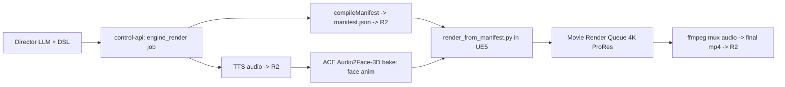

# services/engine — 3D-engine cinematic render node

This directory holds the **Unreal Engine 5 side** of the LiveAvatarStream
3D-engine pivot (offline cinematic 4K POC). It is **not** a Node/TypeScript
service and it does **not** run in this repo's dev environment.

> ⚠️ **Requires a UE5 + RTX/L40S workstation or cloud node.** This coding
> environment has no Unreal Engine, no MetaHuman, and no RTX/display GPU, so the
> script here is **best-effort and untested locally**. It imports `unreal`, which
> only exists inside the UE editor Python runtime. Follow `POC_SETUP.md` to run
> it on a real box.

## What's here

| File | Purpose |
|---|---|
| `render_from_manifest.py` | UE5 Movie Render Queue Python driver. Consumes a `PerformanceManifest` (the control-plane hand-off contract) + the TTS audio, builds a Level Sequence (audio + body Montages + ACE Audio2Face facial bake + Cine Camera moves), and renders 4K via MRQ headless. |
| `POC_SETUP.md` | Exact workstation/cloud runbook: install UE5 + the MIT-licensed ACE Audio2Face-3D plugin + MetaHuman, build the stage + 3 Montages, run the render headless, GPU type + rough cost. |

## Where it fits

The control plane (`services/control-api`) owns the brain (DSL), the voice (TTS),
and manifest compilation. This node owns body animation, the stage, the virtual
camera, and recording. The manifest is the only contract between them — see
`packages/protocol/src/manifest.ts`.

## The contract: PerformanceManifest

`render_from_manifest.py` reads a fully-resolved JSON timeline. Each beat already
carries absolute timing, a resolved Animation Montage id, an ACE Audio2Face
emotion drive, posture blend params, and a camera cue. The engine never
re-interprets the DSL. The canonical schema + compiler live in the protocol
package; a JSON Schema is emitted to
`packages/protocol/dist/schema/PerformanceManifest.json` via `npm run protocol:schema`.

## Realtime later, not now

This POC is **offline cinematic 4K** via Movie Render Queue. Realtime / Pixel
Streaming (and conversational NPC stacks like Convai / Inworld) are a later phase
and are intentionally out of scope here.
