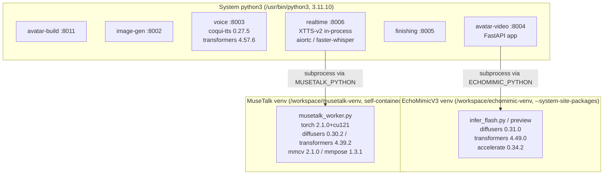
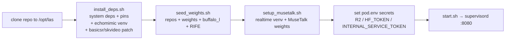
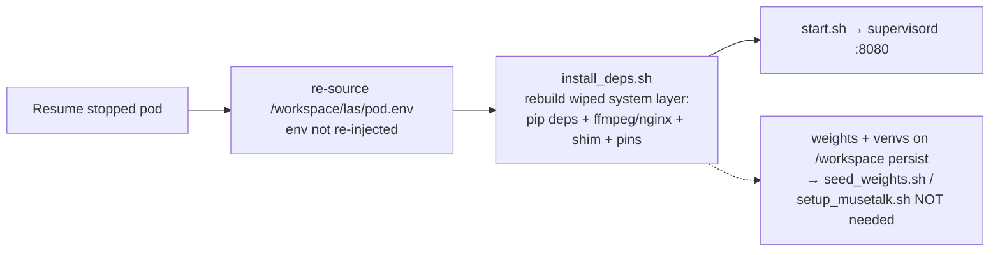

# GPU pod environment setup (reproducibility)

This documents the **pod-only environment fixes** applied on the H100 RunPod pod
during Wave 2 that are **not** captured by the in-repo `requirements.txt` files
or `start.sh`. The repo code (services, `start.sh`, `supervisord.conf`,
`nginx.conf`, `seed_weights.sh`) is the source of truth for the application; this
file is the source of truth for the **interpreter/package layout** that makes
those services actually import and run on the pod.

Pinned freeze snapshots captured from the validated pod live alongside this file:

- [`requirements.pod-system.txt`](./requirements.pod-system.txt) — full `pip freeze` of the **system** interpreter (`/usr/bin/python3`, Python 3.11.10).
- [`requirements.pod-echomimic.txt`](./requirements.pod-echomimic.txt) — full `pip freeze` of the **EchoMimicV3 venv** (`/workspace/echomimic-venv`, Python 3.11.10, `--system-site-packages`).

> Secrets check: both freeze files were scanned and contain no credentials.

## Why two interpreters

The voice service (`coqui-tts`) and the avatar-video service (EchoMimicV3) have
**conflicting** `transformers` requirements:

- `coqui-tts==0.27.5` needs a **newer** `transformers` (pinned **4.57.6** system-wide).
- EchoMimicV3's tested Wan2.1 stack needs **older** `transformers==4.49.0` +
  `diffusers==0.31.0` + `accelerate==0.34.2` (newer `diffusers` ships a
  flash-attn-3 custom op whose schema torch 2.4 can't infer → import-time crash).

Rather than break one of them, EchoMimicV3 inference runs in an **isolated venv**
and `avatar-video` shells out to it via `ECHOMIMIC_PYTHON`
(`/workspace/echomimic-venv/bin/python`, wired in `start.sh` and consumed by
`avatar-video/models.py`). Everything else runs on the system interpreter.



## Pod bring-up: `install_deps.sh`

[`install_deps.sh`](./install_deps.sh) is the package/interpreter-layout half of
bring-up and is the source of truth for everything in this section. It is
**idempotent** and performs, on a fresh pod (after the repo is cloned to
`/opt/las`):

1. system packages (`ffmpeg`, `nginx`)
2. system-interpreter pip installs: each service's `requirements.txt` (except
   avatar-video's heavy EchoMimicV3 block), `supervisor`, editable `las_common`,
   and the §1 pins below
3. the isolated EchoMimicV3 venv (§2), incl. the `ml_dtypes==0.5.4` venv pin
4. the torchvision `functional_tensor` shim + `basicsr` patch (§3)
5. `sk-video` + its numpy patch (§4c)

```bash
bash services/gpu/deploy/install_deps.sh
# then weights + realtime venv + launch:
bash services/gpu/deploy/seed_weights.sh        # weights onto the volume (incl. buffalo_l, RIFE)
bash services/gpu/deploy/setup_musetalk.sh      # realtime MuseTalk venv (own torch)
set -a; . /opt/las/pod.env; set +a              # R2 / HF_TOKEN / INTERNAL_SERVICE_TOKEN
bash services/gpu/deploy/start.sh               # supervisord -> gateway :8080
```

The sections below document **what** each fix is and **why**, so the behaviour is
auditable even though `install_deps.sh` applies them for you. The buffalo_l
preseed (§4) and RIFE weights (§4c) are seeded by `seed_weights.sh` / `start.sh`,
not `install_deps.sh`.

### 1. System interpreter package pins

```bash
# coqui-tts needs a modern transformers; this is the system-wide pin.
python3 -m pip install 'transformers==4.57.6'

# diffusers/accelerate kept at the EchoMimic-compatible versions system-wide too.
python3 -m pip install 'diffusers==0.31.0' 'accelerate==0.34.2'

# coqui-tts (XTTS-v2) requires a recent ml_dtypes; older wheels break tensorflow import.
python3 -m pip install 'ml_dtypes>=0.5.4'
```

### 2. Isolated EchoMimicV3 venv

```bash
# Inherits system site-packages (torch 2.4.1+cu124, torchvision 0.19.1+cu124, CUDA libs)
# so we don't re-download multi-GB GPU wheels, then overrides the 3 conflicting libs.
python3 -m venv --system-site-packages /workspace/echomimic-venv
/workspace/echomimic-venv/bin/python -m pip install \
    'diffusers==0.31.0' 'transformers==4.49.0' 'accelerate==0.34.2'
# onnx in this stack needs float4_e2m1fn -> pin ml_dtypes==0.5.4 inside the venv
# too (don't rely on the inherited system wheel resolving to it).
/workspace/echomimic-venv/bin/python -m pip install 'ml_dtypes==0.5.4'
# (plus the rest of avatar-video/requirements.txt as needed by infer_flash.py)
```

`start.sh` already defaults `ECHOMIMIC_PYTHON=/workspace/echomimic-venv/bin/python`,
so once the venv exists the avatar-video service uses it automatically.

### 2b. Isolated MuseTalk venv (realtime lip-sync)

The realtime service (`realtime/`) lip-syncs with **MuseTalk**
(`TMElyralab/MuseTalk`), which pins **diffusers 0.30.2 / transformers 4.39.2 /
numpy 1.23.5 / tensorflow 2.12** and needs the **OpenMMLab dwpose stack**
(`mmcv`/`mmdet`/`mmpose`) for landmark detection during avatar preparation. None
of these are compatible with the system interpreter (coqui-tts/transformers 4.57,
torch 2.4 — which has **no prebuilt mmcv wheel**). So MuseTalk runs in its own
**self-contained** venv (its own torch 2.1.0+cu121, the newest combo with
prebuilt mmcv wheels and good H100/sm_90 support), driven out-of-process by
`realtime/musetalk_worker.py` via `MUSETALK_PYTHON`.

```bash
# Builds /workspace/musetalk-venv (own torch + dwpose stack) AND downloads the
# MuseTalk realtime weights into /workspace/repos/MuseTalk/models/. Idempotent.
bash services/gpu/deploy/setup_musetalk.sh
```

`start.sh` defaults `MUSETALK_PYTHON=/workspace/musetalk-venv/bin/python`,
`MUSETALK_VERSION=v15`, and `MUSETALK_AVATAR_CACHE=/workspace/musetalk-avatars`
(precomputed per-avatar latents/masks persist there, so repeat sessions skip
preparation). Pinned manifest: [`requirements.pod-musetalk.txt`](./requirements.pod-musetalk.txt).

The realtime service voices turns with **XTTS-v2 in-process** (system
`coqui-tts`) and streams audio chunks into the MuseTalk worker.

> dwpose/mmcv on a modern GPU is the fragile step. We deliberately do **not**
> reuse the system torch 2.4 (no mmcv wheel → source build). The venv pins
> torch 2.1.0+cu121 so `mim install "mmcv==2.1.0"` lands a prebuilt wheel.

Validate the generation path (no SFU needed):

```bash
set -a; . /opt/las/pod.env; set +a
cd /opt/las/services/gpu/realtime
PYTHONPATH=/opt/las/services/gpu/common python3 validate_musetalk.py \
    --avatar-prefix demo-user/<av_id> --voice-prefix demo-user/<vo_id> \
    --out /workspace/musetalk_validation.mp4 --upload
```

### 3. torchvision `functional_tensor` shim + `basicsr` patch (finishing service)

`basicsr==1.4.2`, `gfpgan` and `realesrgan` all import `rgb_to_grayscale` from
the removed `torchvision.transforms.functional_tensor` module, which crashes on
torchvision 0.19. `install_deps.sh` installs a **shim module** that re-exports
`rgb_to_grayscale`, so every consumer resolves (not just the one `basicsr` file
the `sed` rewrites). The shim is the durable fix; the `sed` stays as
belt-and-suspenders. Both are idempotent.

```bash
# Shim: re-export rgb_to_grayscale at the old module path.
TV=$(python3 -c "import torchvision.transforms as t, os; print(os.path.dirname(t.__file__))")
cat > "$TV/functional_tensor.py" <<'PY'
from torchvision.transforms.functional import rgb_to_grayscale  # noqa: F401
PY

# Belt-and-suspenders: rewrite the basicsr import too.
BASICSR=$(python3 -c "import basicsr, os; print(os.path.dirname(basicsr.__file__))")
sed -i 's/from torchvision.transforms.functional_tensor import rgb_to_grayscale/from torchvision.transforms.functional import rgb_to_grayscale/' \
    "$BASICSR/data/degradations.py"
```

Because torchvision lives in the **system** site-packages (container disk), the
shim must be re-applied on every pod resume — `install_deps.sh` does this.

### 4. insightface `buffalo_l` on the persistent volume (avatar-build)

insightface **ignores `INSIGHTFACE_HOME`** and always reads `~/.insightface`, which
is ephemeral container disk — so `buffalo_l` re-downloads on every pod restart (and
the ~3-min first-build download is what made `POST /api/avatars` time out). Fix:
symlink `~/.insightface` onto the volume so the pack persists. `deploy/start.sh`
and `deploy/seed_weights.sh` now do this automatically; the manual one-time step on
an already-running pod is:

```bash
# Move any existing pack onto the volume, then symlink.
INSIGHTFACE_HOME=/workspace/.model_cache/insightface
mkdir -p "$INSIGHTFACE_HOME"
[ -d /root/.insightface ] && cp -an /root/.insightface/. "$INSIGHTFACE_HOME/" && rm -rf /root/.insightface
ln -sfn "$INSIGHTFACE_HOME" /root/.insightface
# Preseed buffalo_l (lands on the volume via the symlink).
python3 - <<'PY'
from insightface.app import FaceAnalysis
FaceAnalysis(name="buffalo_l")  # one-time download+unzip; persists on the volume
PY
```

`avatar-build/pipeline.py` and `avatar-video/echomimic_preview_infer.py` also pass
`root=$INSIGHTFACE_HOME` to `FaceAnalysis` for belt-and-braces.

### 4b. EchoMimicV3-preview face mask uses insightface, not retinaface (avatar-video)

Upstream's `src/face_detect.get_mask_coord` pulls in `retinaface` →
`tensorflow.keras`, which the system-wide `ml_dtypes>=0.5.4` pin (needed by
coqui-tts) breaks inside the EchoMimic venv (`No module named 'tensorflow.keras'`).
Our wrapper `echomimic_preview_infer.py` now computes the IP-mask bbox with
insightface (`buffalo_l`, onnxruntime, CPU) instead — no tensorflow/retinaface on
the premium path. No pod-side step required beyond §4 (buffalo_l on the volume).

### 4c. Practical-RIFE weights + sk-video patch (finishing)

Practical-RIFE ships **no weights** in git, so the finishing chain's RIFE
interpolation silently fell back to source fps. Seed the v4.25 `train_log/`
(handled automatically by `deploy/seed_weights.sh`; manual step shown below) and
patch `sk-video` (which `inference_video.py` imports) for numpy>=1.24:

```bash
# RIFE v4.25 weights -> train_log/{flownet.pkl,RIFE_HDv3.py,IFNet_HDv3.py,refine.py}
python3 -m gdown 1ZKjcbmt1hypiFprJPIKW0Tt0lr_2i7bg -O /tmp/rife.zip
python3 -c "import zipfile; zipfile.ZipFile('/tmp/rife.zip').extractall('/tmp/rife')"
cp -r /tmp/rife/train_log /workspace/models/Practical-RIFE/

# sk-video (Practical-RIFE inference_video.py dep) uses removed np.float/np.int.
python3 -m pip install sk-video
SK=$(python3 -c "import skvideo,os;print(os.path.dirname(skvideo.__file__))")
grep -rEl 'np\.(float|int|bool|object)([^0-9a-zA-Z_])' "$SK" | while read f; do
  sed -i -E 's/np\.float([^0-9a-zA-Z_])/float\1/g; s/np\.int([^0-9a-zA-Z_])/int\1/g; s/np\.bool([^0-9a-zA-Z_])/bool\1/g; s/np\.object([^0-9a-zA-Z_])/object\1/g' "$f"
done
```

If the RIFE weights are unavailable, the finishing chain logs the real error and
falls back to ffmpeg `minterpolate` so the clip still hits the requested fps.

### 5. avatar-build port remap `8001 → 8011`

`avatar-build` was moved off `:8001` to `:8011` (already reflected in
`supervisord.conf` and `nginx.conf` in the repo) to avoid a port clash on the pod.
No extra manual step — noted here because it diverges from the original
`8001-8006` contiguous block mentioned in older comments.

## 6. engine-three (3D cinematic render)

Three.js headless render node co-located on the H100 pod:

| Item | Value |
|---|---|
| Process | `node dist/index.js` via supervisord `[program:engine-three]` |
| Port | `127.0.0.1:8090` |
| Gateway | `http://localhost:8080/engine-three/health` |
| Assets | `/opt/las/services/engine-three/assets/` (avatar glTF, fixtures) |
| Env | `RENDER_PROFILE=dev` (1080p POC), `LIPSYNC_MODE=envelope\|viseme`, `MONTAGE_MODE=procedural` |

Built by `install_deps.sh` §8 (Node 20 + `npm run build` for `@las/engine-three`).

Validate:

```bash
curl -s localhost:8080/engine-three/health
python3 services/gpu/deploy/validate_engine_render.py --api "$CONTROL_API_URL" --video demo_video.mp4
```

## Reproducing on a fresh pod



`pod.env` (R2 credentials, `HF_TOKEN`, `INTERNAL_SERVICE_TOKEN`, cache dirs) is
**not** committed — populate it from `.env.example` on the pod. `restart_services.sh`
sources `pod.env` then re-launches `start.sh` with `SEED_WEIGHTS=0`.

## Resuming a stopped pod

> **RunPod wipes the container disk on resume.** Only `/workspace` (the network
> volume) survives a stop/resume. Everything on the container root filesystem —
> the system interpreter's site-packages, `apt` packages (`ffmpeg`, `nginx`), the
> basicsr/torchvision shim, and the editable `las_common` install — is **gone**
> after resume. **Environment variables are also NOT re-injected** on resume, so
> the pod comes back with an empty env even though the shell history remains.

What this means in practice:

- **Persists on `/workspace`:** weights, the EchoMimicV3 venv
  (`/workspace/echomimic-venv`), the MuseTalk venv (`/workspace/musetalk-venv`),
  the buffalo_l / RIFE / model caches, and (by design on the validated pod) the
  repo clone + `pod.env` under `/workspace/las`. Because these survive,
  `seed_weights.sh` and `setup_musetalk.sh` do **not** need to re-run.
- **Wiped on resume (must be re-established):** all system-interpreter Python
  packages, `ffmpeg`/`nginx`, and the torchvision `functional_tensor` shim. The
  venvs persist but inherit the (now-empty) system site-packages, so the system
  layer must be rebuilt before they work again. `install_deps.sh` rebuilds
  exactly this layer and is idempotent — that is why it re-runs on every resume.
- **Env not re-injected:** you must re-source `pod.env` in the new shell.

Keep the repo and `pod.env` on the volume (`/workspace/las`) so they survive the
wipe; a clone on container disk (`/opt/las`) would be lost on resume.

### Resume bring-up sequence

```bash
# 1. Start the stopped pod (RunPod console / API), then open a shell.
# 2. Re-inject the environment (NOT done automatically on resume).
set -a; . /workspace/las/pod.env; set +a
# 3. Rebuild the wiped system layer (system pip deps, ffmpeg/nginx, shim, pins).
#    Venv + weights on /workspace persist, so this is fast on the re-resolve.
bash /workspace/las/services/gpu/deploy/install_deps.sh
# 4. Relaunch the process tree -> gateway on :8080.
bash /workspace/las/services/gpu/deploy/start.sh
```



`seed_weights.sh` is **not** needed on resume (weights persist on `/workspace`);
only run it again if the volume itself was recreated.
